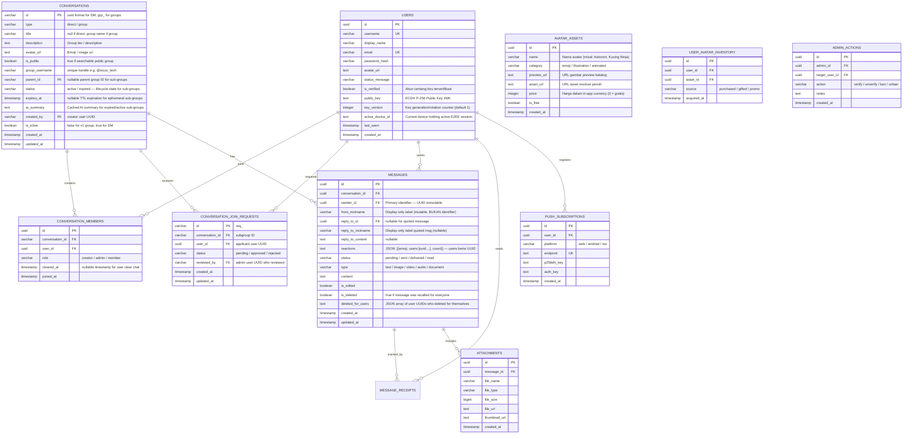
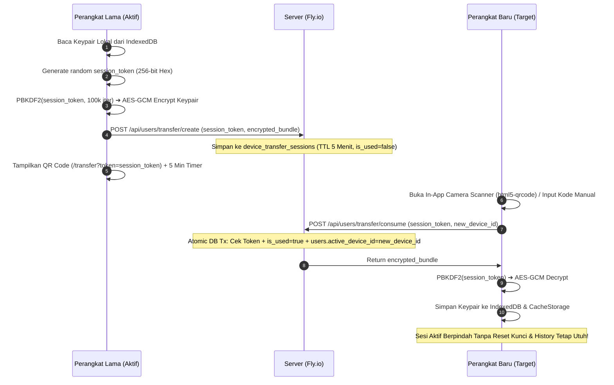
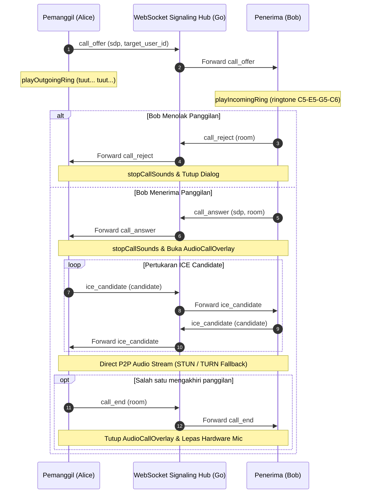
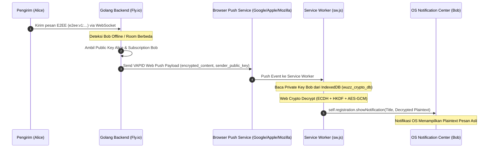

# Spesifikasi Desain Arsitektur & Database — Wuzz Chat

Dokumen ini mendefinisikan desain skema data, alur komunikasi WebSocket, dan standar API untuk evolusi platform **Wuzz Chat** menuju aplikasi chatting modern kelas WhatsApp/Telegram.

---

## 🗄️ 1. Skema Database Relasional (PostgreSQL / Supabase)

Untuk mendukung percakapan berkelanjutan (*Direct Message & Group*), daftar kontak, profil pengguna, dan tanda terima pesan (*read receipts*), skema database dirancang sebagai berikut:



> **📌 Catatan Fase 9 (PLANNED)**: Tabel `AVATAR_ASSETS`, `USER_AVATAR_INVENTORY`, dan `ADMIN_ACTIONS` belum dibuat di database production. Skema di atas adalah desain target untuk Milestone 9.1 (Verified System) dan Milestone 9.2 (Avatar Premium). Lihat `docs/ROADMAP.md#fase-9` untuk detail spesifikasi.

---

## 📡 2. Protokol Komunikasi WebSocket (Payload Standard & Autentikasi)

### A. Handshake Autentikasi (`/ws`)
Koneksi WebSocket mewajibkan autentikasi token JWT sebelum upgrade connection dilakukan. Token dapat dikirimkan melalui parameter query `?token=<jwt>` atau header `Authorization: Bearer <jwt>`.
- Jika token tidak valid atau tidak disertakan ➔ Server merespons `401 Unauthorized`.
- Jika token valid ➔ Server melakukan upgrade ke WebSocket dan secara otomatis mengikat identitas koneksi:
  - `ClientID` = `claims.UserID` (**UUID immutable** — digunakan sebagai primary identifier di semua logika otorisasi, receipt tracking, dan ownership check).
  - `Nickname` = `claims.DisplayName` / `claims.Username` (hanya untuk tampilan label, **BUKAN** identifier).
- Server **tidak pernah mempercayai** `from` atau `nickname` dari payload klien; identitas selalu di-*enforce* dari JWT claims.

### B. Format Amplop Pesan (Payload Envelope)

> **🔑 UUID-First Identity Principle**: Field `from` selalu berisi **UUID immutable** (`sender_id`) pengirim yang di-*enforce* dari JWT. Field `nickname` hanya berperan sebagai display label yang dapat berubah. Semua logika otorisasi, read-receipt tracking, dan ownership check wajib menggunakan `from` (UUID), bukan `nickname`.

```json
{
  "id": "uuid-v4-event",
  "type": "message | typing | receipt | reaction | room_users | history | system",
  "room": "dm_xxx / room-xxx",
  "from": "uuid-sender",
  "nickname": "Alice",
  "content": "Isi pesan...",
  "status": "pending | sent | delivered | read",
  "reply_to": {
    "id": "uuid-quoted-msg",
    "nickname": "Bob",
    "content": "Pesan yang dibalas"
  },
  "reactions": [
    { "emoji": "❤️", "users": ["uuid-user-1"], "count": 1 }
  ],
  "timestamp": "2026-09-12T03:00:00Z"
}
```

> **📌 Catatan `reactions.users`**: Array `users` di dalam setiap item `reactions` berisi **UUID pengguna** (bukan username/nickname). Frontend wajib membandingkan item di array ini dengan `currentUser.id` (UUID) untuk menentukan apakah user saat ini sudah memberikan reaksi tersebut.

### B. Daftar Tipe Event:
| Event Type | Arah | Penjelasan |
|---|---|---|
| `message` | Bidirectional | Pengiriman dan penerimaan pesan teks/media |
| `message_deleted` | Server ➔ Client | Broadcast notifikasi pesan ditarik/dihapus untuk semua orang |
| `typing` | Bidirectional | Notifikasi bahwa user sedang mengetik di obrolan |
| `receipt` | Bidirectional | Laporan status pesan (`sent`, `delivered`, `read`) secara single atau bulk room |
| `reaction`| Bidirectional | Toggle penambahan/penghapusan reaksi emoji pada pesan |
| `room_users`| Server ➔ Client | Daftar anggota aktif dalam satu obrolan (presence realtime) |
| `history` | Server ➔ Client | Pengiriman riwayat pesan persisten saat user join ke obrolan |
| `join` | Client ➔ Server | Permintaan bergabung ke room tertentu; identitas diambil dari JWT (UUID), bukan dari payload |
| `call_offer` | Bidirectional | Sinyal WebRTC SDP Offer saat pemanggil memulai panggilan suara/video |
| `call_answer`| Bidirectional | Sinyal WebRTC SDP Answer saat penerima menerima panggilan suara/video |
| `ice_candidate` | Bidirectional | Pertukaran ICE candidate WebRTC untuk traversal NAT/STUN |
| `call_reject` | Bidirectional | Notifikasi penolakan panggilan oleh penerima |
| `call_end` | Bidirectional | Notifikasi pengakhiran panggilan oleh salah satu pihak |
| `call_busy` | Bidirectional | Notifikasi bahwa penerima sedang sibuk dalam panggilan lain |

> **📊 Semantik Tanda Terima (Receipts): DM vs Grup**:
> - **Direct Message (1-on-1)**: Mengikuti alur penuh bilateral: `pending` (jam) ➔ `sent` (✓) ➔ `delivered` (✓✓ abu-abu) ➔ `read` (✓✓ Electric Neon Cyan). Laporan `read` dipancarkan seketika saat penerima membuka chat.
> - **Obrolan Grup**: Tanda terima difokuskan pada pengiriman ke room (`sent` ✓ / `delivered` ✓✓). Untuk mencegah ledakan komputasi dan badai event (*event storm* bernilai $O(N \times M)$ pada grup beranggotakan puluhan/ratusan user), backend tidak memancarkan centang biru per-anggota pada bubble linimasa. Pelacakan detail pembacaan per-anggota dialokasikan sebagai fitur lanjutan *Message Info Drawer* di masa depan.

## 🔐 3. Standar API & Autentikasi (REST Endpoints)

| Method | Endpoint | Fungsi | Auth |
|---|---|---|---|
| `POST` | `/api/auth/register` | Pendaftaran akun user baru | Public |
| `POST` | `/api/auth/login` | Login dan generate JWT token | Public |
| `GET` | `/api/auth/me` | Mengambil profil user yang sedang login (termasuk `is_verified`) | Bearer Token |
| `PUT` | `/api/auth/profile` | Memperbarui display name, status bio, dan avatar | Bearer Token |
| `PUT` | `/api/users/public-key` | Mendaftarkan / memperbarui Public Key kriptografi E2EE | Bearer Token |
| `GET` | `/api/users/profile?id=&username=` | Mengambil profil publik pengguna lain via UUID atau @username (termasuk `public_key` & `is_verified`) | Bearer Token |
| `GET` | `/api/users/search?q=` | Mencari user berdasarkan username/nama (termasuk `public_key` & `is_verified`) | Bearer Token |
| `GET` | `/api/conversations` | Daftar obrolan aktif beserta pesan terakhir, `peer_public_key`, `peer_avatar_url`, dan `peer_is_verified` | Bearer Token |
| `POST` | `/api/conversations` | Membuat obrolan baru (Direct atau Group) | Bearer Token |
| `DELETE` / `POST` | `/api/conversations?id=` / `/api/conversations/clear` | Menghapus riwayat percakapan untuk user pemanggil (*Delete for Me*) | Bearer Token |
| `DELETE` / `POST` | `/api/messages?id=&type=` / `/api/messages/delete` | Menghapus pesan (*for_me* kapanpun, atau *for_everyone* ≤ 60s) | Bearer Token |
| `POST` | `/api/groups` | Membuat grup baru (publik / privat) | Bearer Token |
| `GET` | `/api/groups/search?q=` | Mencari grup publik berdasarkan username/nama | Bearer Token |
| `GET` | `/api/groups/{id}` | Mengambil detail grup atau subgrup (Parent Gate protected) | Bearer Token |
| `POST` | `/api/groups/{id}/join` | Bergabung ke grup publik atau subgrup (Parent-Membership Gate) | Bearer Token |
| `GET` | `/api/groups/{id}/members` | Daftar anggota grup dan role | Bearer Token |
| `POST` | `/api/groups/{id}/members` | Menambahkan anggota ke grup (Admin/Creator) | Bearer Token |
| `DELETE` | `/api/groups/{id}/members/{userId}` | Kick / mengeluarkan anggota dari grup | Bearer Token |
| `PATCH` | `/api/groups/{id}/members/{userId}/role` | Promosi / demosi role anggota (`admin`/`member`) | Bearer Token |
| `PATCH` | `/api/groups/{id}` | Mengubah informasi profil grup | Bearer Token |
| `GET` | `/api/groups/{id}/subgroups` | Daftar topik & forum aktif (Parent-Membership Gate) | Bearer Token |
| `POST` | `/api/groups/{id}/subgroups` | Membuat topik forum baru dengan durasi TTL (7d/30d) dan visibilitas (terbuka/privat) | Bearer Token |
| `POST` | `/api/groups/{id}/join-request` | Mengajukan izin bergabung ke topik forum privat | Bearer Token |
| `GET` | `/api/groups/{id}/join-requests` | Daftar permohonan izin pending (khusus Admin/Creator) | Bearer Token |
| `POST` | `/api/groups/{id}/join-requests/{requestId}/action` | Menyetujui atau menolak izin bergabung (`approve`/`reject`) | Bearer Token |

> **🛡️ Message Deletion Ownership & Interface**: Pengecekan kepemilikan pesan pada *Delete for Everyone* divalidasi secara ketat di backend menggunakan `msg.FromID == claims.UserID` (UUID). Parameter display name dihilangkan sepenuhnya dari kontrak `MessageStore.DeleteMessage(msgID, userID string, deleteForEveryone bool)`.

| `POST` | `/api/media/upload` | Upload file gambar/dokumen/audio ke storage | Bearer Token |
| `POST` | `/api/media/ack` | Konfirmasi download file oleh client (memicu auto-delete file fisik) | Bearer Token |
| `GET` | `/api/notifications/vapid-public-key` | Mengambil VAPID Public Key untuk PushManager browser | Public |
| `POST` | `/api/notifications/subscribe` | Mendaftarkan endpoint & kunci push subscription per perangkat | Bearer Token |
| `POST` | `/api/notifications/unsubscribe` | Mencabut endpoint push subscription saat logout/toggle off | Bearer Token |
| `GET` | `/api/link-preview?url=` | Scraping aman metadata OpenGraph (SSRF protected & cached) | Bearer Token |
| `GET` | `/api/config` | Mengambil status konfigurasi publik (media upload toggle & retention) | Public |

---

## 📦 4. Panduan Ekstensi Media Storage & WhatsApp-Style Store-and-Forward

Backend WuzzChat menggunakan kontrak tunggal `MediaStorage` di `backend/internal/storage/storage.go`:

```go
type MediaStorage interface {
    Upload(ctx context.Context, file io.Reader, filename string, contentType string) (publicURL string, err error)
    Delete(ctx context.Context, fileKey string) error
    DriverName() string
}
```

### 🔄 Siklus Hidup Media (Store-and-Forward & IndexedDB Caching)

1. **Upload & Transit Buffer**: File diunggah ke storage (Supabase / Local) hanya sebagai penampung sementara (*transit buffer*).
2. **Download & Client Caching**: Klien penerima mengunduh binary blob dan menyimpannya secara offline ke browser **IndexedDB** (`mediaCache.ts`).
3. **Immediate Server Purge (ACK)**: Klien mengirim `POST /api/media/ack`. Server langsung memanggil `storage.Delete()` untuk menghapus berkas fisik dari server disk/bucket ($0 Server Storage Cost).
4. **TTL Background Auto-Purge (`PurgeWorker`)**: Berkas yang belum pernah diunduh melebihi `MEDIA_RETENTION_DAYS` (default 7 hari) otomatis dibersihkan oleh goroutine worker berkala.
5. **Client Pre-Upload Compression**: Klien mengompresi gambar otomatis (`imageCompressor.ts`, max 1600px, WebP quality 0.82) dengan opsi toggle yang dapat dimatikan kapan saja.

### 👥 Perbedaan Retensi Media: Direct Message (DM) vs Obrolan Grup & Forum Topics
| Parameter | Direct Message (1-on-1) | Obrolan Grup & Forum Topics (1-to-Many) |
| :--- | :--- | :--- |
| **Model Distribusi** | *Store-and-Forward Transit Buffer* | *Shared Media Hub (TTL-Based)* |
| **Trigger Hapus Fisik** | Langsung dihapus seketika saat penerima mengirimkan ACK (`POST /api/media/ack`). | **TIDAK dihapus oleh ACK orang pertama**. Berkas bertahan di Supabase Storage selama masa retensi TTL penuh (default 7 hari) agar anggota lain yang online belakangan tetap dapat mengunduhnya. |
| **Status Media di Database** | Berubah menjadi `'expired'` seketika setelah di-ACK. | **Tetap `'active'`** agar seluruh anggota grup/forum dapat mengunduh gambar ke IndexedDB masing-masing tanpa terkena box *Media Kedaluwarsa*. |
| **Penyimpanan Lokal Klien** | Tersimpan di IndexedDB browser penerima (`wuzzchat_media_db`). | Anggota yang sudah membuka media langsung meng-cache blob ke **IndexedDB lokal masing-masing**, mencegah pengunduhan ulang. |
| **Pembersihan Server** | Segera setelah diunduh, atau maksimal 7 hari jika penerima offline lama. | Dihapus otomatis oleh `PurgeWorker` setiap 1 jam untuk berkas yang telah melampaui `MEDIA_RETENTION_DAYS` (7 hari). |

### ⚡ Strategi Riwayat Pesan: Limitasi 50 Pesan Awal & Cache-First IndexedDB
1. **Mengapa Query Membatasi 50 Pesan Terbaru (`LIMIT 50`)?**
   - Query backend (`sql.go:490`) menggunakan klausa `ORDER BY created_at DESC LIMIT 50` yang memanfaatkan indeks komposit `idx_messages_room_created (room_id, created_at DESC)`.
   - Hal ini menjamin performa query selalu berada pada kompleksitas **$O(\log N)$** terlepas dari apakah room memiliki 1.000 atau 1.000.000 baris pesan.
   - Menghemat kuota transfer data pengguna dan mencegah konsumsi memori browser (*DOM node bloat*) yang dapat menyebabkan browser ponsel lag/freeze jika merender puluhan ribu pesan sekaligus.
2. **Kontinuitas Pembacaan Offline & Riwayat Lengkap**:
   - **IndexedDB Decrypted Store (`wuzzchat_msg_db`)**: Pesan yang pernah diterima perangkat disimpan secara persisten di database browser lokal. Saat room dibuka, linimasa langsung tampil instan (0ms) dari IndexedDB lokal sebelum respons server tiba (*Cache-First*).
   - **Sinkronisasi Upsert**: Riwayat 50 pesan terkini dari server digabungkan (*upsert*) dengan cache lokal untuk mengisi kekosongan pesan baru yang masuk saat user offline.
   - **Rencana Pagination / Infinite Scroll (Milestone 8.3)**: Untuk mengambil pesan yang lebih lama dari 50 pesan terkini pada perangkat baru, klien akan memanggil pagination berbasis kursor (`before_id`), memuat pesan lama secara bertahap saat pengguna men-scroll linimasa ke atas.

### 🚀 Cara Menambah Provider Storage Baru (Misal: AWS S3 / Cloudflare R2 / GCS):

1. **Buat File Driver Baru**: Buat file `backend/internal/storage/<nama_provider>_storage.go` yang mengimplementasikan ketiga method di atas.
2. **Daftarkan di Factory**: Buka `backend/internal/storage/storage.go`, lalu tambahkan case baru pada fungsi `NewMediaStorageFromEnv()`:
   ```go
   case "s3":
       return NewS3Storage(...)
   ```
3. **Konfigurasi `.env`**: Cukup atur nilai `STORAGE_DRIVER=<nama_provider>` dan tambahkan kredensial terkait.
4. **Zero-Touch Codebase**: Seluruh endpoint REST API, WebSocket Hub, database query, dan frontend Next.js **tidak perlu diubah sama sekali**.

---

## 📱💻 5. Arsitektur Frontend Dual-Platform (Desktop & Mobile)

Aplikasi frontend WuzzChat dirancang untuk memberikan pengalaman optimal di dua form-factor utama:

### A. Pola Layout Dual-Platform
- **Desktop / Laptop (Split 2-Column Mode)**:
  - Sidebar (daftar chat) dan Chat Main Pane (ruang obrolan) aktif berdampingan di satu layar.
  - Event chat masuk langsung ter-append secara live ke timeline chat aktif via `ADD_MESSAGE`.
- **Mobile / Handphone (WhatsApp Single-Screen Flow)**:
  - Layar bergantian penuh: **Layar 1 (Daftar Chat Fullscreen)** ⇄ **Layar 2 (Ruang Obrolan Fullscreen)**.
  - Transisi antar layar menggunakan tombol `← Back` (`activeRoomId = ''`).
  - Viewport menggunakan Dynamic Viewport Height (`100dvh`), header sticky (`position: sticky; top: 0; z-index: 50;`), dan safe area insets `env(safe-area-inset-bottom)`.

### B. Siklus Hidup State & Anti-Stale Lifecycle Guards
```text
[Home HP (Daftar Chat)] ──(Klik Chat)──► [Ruang Obrolan Fullscreen]
       ▲                                            │
       │                                            │ (Kirim/Terima Chat & Read Receipt)
       └──────────────(Klik ← Back)─────────────────┘
```
1. **Clean History State Sync**: Saat berpindah dari Home HP ke ruang obrolan, action `SET_MESSAGES` di `chatReducer` me-reset state bersih dari payload riwayat server (`messages: action.payload`), mencegah penggabungan dengan riwayat lama yang stale.
2. **Anti-Stale Reprocessing Guard (`lastHandledMsgIdRef`)**: Ketika `activeRoomId` berganti menjadi `''` saat user menekan `← Back`, ref guard mencegah `useEffect` memproses ulang `lastIncomingMessage` lama sebagai pesan belum dibaca yang baru.
3. **Real-Time Read Receipts & Dynamic Reload**: Event `receipt` diproses secara terpisah di Sidebar untuk memastikan pembaruan status centang (`✓` ➔ `✓✓` ➔ `✓✓` biru) seketika tanpa refresh, dan memicu reload daftar obrolan saat user kembali ke Home.

### C. Client-Side Persistent Message Cache (IndexedDB)
```text
[Buka Room] ──► [IndexedDB getCachedMessages] ──► Render Timeline (0ms Instant)
                        ▲
                        │ (Write-Through Merge)
[Server Event / REST] ──┴───────────────────────► [IndexedDB cacheMessages]
```
1. **Penyimpanan Lokal Persisten**: Pesan terdekripsi disimpan di IndexedDB browser klien (`wuzzchat_msg_db`) dengan object store `messages` (keyPath: `id`) dan index `by_room` (`roomId, createdAt`).
2. **Pola Cache-First**: Saat pengguna membuka percakapan, snapshot lokal segera dimuat ke UI untuk menghilangkan efek blank/loading, kemudian riwayat dari server digabungkan secara aman di latar belakang.
3. **Kontinuitas E2EE**: Plaintext pesan lama tetap dapat diakses oleh penerima meskipun pengirim melakukan reset perangkat dan mengunggah kunci publik baru.
4. **Anti-Downgrade Status Guard**: Bobot status numerik (`pending: 0, sent: 1, delivered: 2, read: 3, deleted: 99`) mencegah kemunduran status tanda terima saat server mengirimkan status lama.

### D. Arsitektur Header Obrolan & Forum Topics (Collapsible Action Menu)
1. **Pemisahan Breadcrumb Interaktif di Subtitle**:
   - Menghindari penumpukan elemen vertikal (*vertical collision*) dengan meniadakan tombol kembali mengambang di atas judul.
   - Induk grup ditampilkan anggun di baris subtitle obrolan: `[↖ Nama Grup Induk] • Forum • X anggota`.
   - Mengklik link breadcrumb langsung membawa pengguna melompat kembali ke ruang obrolan grup utama secara instan.
2. **Collapsible Action Menu (Tombol Titik Tiga `⋮`) di Mobile**:
   - Di layar sempit (HP ≤ 768px), tombol-tombol aksi sekunder (`Info`, `Link`, `Sound`, `Call`, `E2EE`) dilipat secara default di dalam menu lipat (*collapsed*).
   - Menjaga ruang horizontal nama obrolan **3x lebih lapang (> 80% lebar layar)** tanpa terpotong (*no awkward text truncation*).
   - Menekan tombol `⋮` memicu animasi transisi meluncur halus (*smooth slide-in*) dari kanan dengan tombol toggle bertransisi menjadi `✕` (Tutup).
   - Dilengkapi *outside-click auto dismissal* dan penutupan otomatis saat salah satu aksi dipilih.
3. **Dedicated Quick-Action Button (`🏛️ Forum`)**:
   - Pada grup utama yang memiliki topik/forum, tombol akses cepat `🏛️ Forum` dibiarkan **tetap berada di luar** menu lipat untuk memastikan anggota grup dapat mengakses daftar topik obrolan secara instan hanya dengan 1 kali tap.
4. **Smart Back Navigation Hierarchy**:
   - Tombol kembali `←` di mobile memiliki kecerdasan kontekstual: saat berada di dalam ruang topik forum, tombol `←` otomatis membawa kembali ke grup induk (parent group), menciptakan pengalaman navigasi hirarkis yang alami seperti Telegram Forums & Discord Threads.

---

## 🔐 6. Spesifikasi End-to-End Encryption (E2EE)

WuzzChat mengadopsi standar kriptografi terbuka (*Open RFC Cryptography*) yang menjamin privasi mutlak (*Zero-Knowledge Privacy*) sekaligus fleksibilitas lintas platform:

### A. Primitif Kriptografi
- **Key Agreement**: **ECDH (NIST P-256 / secp256r1)**.
- **Key Derivation Function**: **HKDF-SHA256 (RFC 5869)** dengan room-level salt deterministik.
- **Symmetric Cipher**: **AES-256-GCM (NIST SP 800-38D)** dengan 96-bit (12-byte) initialization vector (IV) unik acak per pesan.
- **Ciphertext Wire Format**: `e2ee:v1:<base64(iv)>:<base64(ciphertext)>`.

### B. Alur Enkripsi & Dekripsi
```text
[Pengirim (Alice)] ──(ECDH + HKDF ➔ AES-GCM Encrypt)──► [Ciphertext e2ee:v1:...]
                                                               │
                                                   (WebSocket & DB Supabase)
                                                               │
[Penerima (Bob)]   ◄──(ECDH + HKDF ➔ AES-GCM Decrypt)── [Ciphertext e2ee:v1:...]
```

### C. Kompatibilitas Multi-Platform (Cross-Platform Interoperability)
Karena seluruh algoritma menggunakan standar resmi NIST & RFC:
- **Web (Next.js)**: Menggunakan `window.crypto.subtle` bawaan browser dengan penyimpanan private key di `IndexedDB` (`wuzz_crypto_db`).
- **Android Native (Kotlin)**: Dapat langsung menggunakan `java.security.KeyPairGenerator` (secp256r1) + `javax.crypto.Cipher` (AES/GCM/NoPadding) dengan private key di Android Keystore.
- **Flutter / React Native**: Menggunakan package standard `cryptography` / `react-native-quick-crypto`.
- Klien web dan klien mobile dapat saling berkirim pesan terenkripsi secara langsung tanpa hambatan format.

### D. Verifikasi Keamanan Visual (Safety Number Fingerprint)
- Digest SHA-256 dari gabungan kunci publik kedua pihak yang diurutkan secara deterministik, diformat menjadi 6 blok angka 5 digit (total 30 digit) untuk perbandingan manual visual antar pengguna.

### E. Single Active Device, Hard Conflict Blocker & WebSocket Kick
- **Active Device Tracking**: Server melacak `active_device_id` dan `key_version` per akun di tabel `users`.
- **Hard Blocker UI Guard**: Jika akun sedang mengalami konflik perangkat, frontend memblokir total render UI chat (`chat-layout` tidak dimount ke DOM). Menutup modal atau gesture back HP otomatis mengarahkan ke `logout()` bersih.
- **Fail-Closed E2EE Guard**: Pengiriman pesan langsung (direct chat) diwajibkan melewati enkripsi AES-256-GCM. Jika kunci sesi lokal `null`, pengiriman langsung dibatalkan (0% kebocoran plaintext).
- **Single-Session WebSocket Kick**: Backend Go `Hub.Register` mendeteksi jika client baru terhubung dengan UserID yang sama dengan client aktif, mengirimkan event notifikasi penutupan `SESSION_REPLACED`, dan memutus koneksi WebSocket client lama seketika (`conn.Close()`).
- **Explicit Key Rotation**: Kunci hanya dapat dirotasi secara sadar melalui `POST /api/users/public-key/reset` yang menaikkan `key_version`. Sesi device lama otomatis kedaluwarsa.

### F. Zero-Knowledge QR Code Key Migration Protocol (Opsi 2)


1. **Jaminan Keamanan Zero-Knowledge**: Private key tidak pernah menyentuh database server dalam bentuk plaintext. Hanya ciphertext terenkripsi AES-256-GCM dengan kunci turunan dari session token yang disimpan sementara di tabel `device_transfer_sessions`.
2. **In-App Camera Scanner Terintegrasi**: Perangkat baru menggunakan library `html5-qrcode` langsung di dalam modal untuk memindai QR code dari layar perangkat lama. Untuk Android PWA WebAPK, diterapkan **Pre-Warm Permission Strategy** (memanggil `getUserMedia()` sesegera mungkin sebelum async chain agar gesture token pengguna tidak kedaluwarsa) dan **Native Camera Intent Capture Fallback** (`<input type="file" accept="image/*" capture="environment">`) yang memicu intent kamera sistem Android native tanpa terbatas oleh `Permissions Policy` WebView. Manifest PWA juga mendeklarasikan `"permissions": ["camera"]` untuk instalasi WebAPK.
3. **Atomic One-Time Use**: Operasi download dan pengalihan status sesi dikunci dalam 1 transaksi database SQL (`SELECT ... FOR UPDATE` di PostgreSQL / `BEGIN EXCLUSIVE` di SQLite) untuk mencegah race condition atau double-consumption.
4. **Resilience & Fallback Berlapis**: Sesi transfer otomatis kedaluwarsa dalam 5 menit. Terdapat 3 jalur fallback: (a) **In-App Live Scanner** (`html5-qrcode` dengan pre-warm strategy), (b) **Native Camera Capture** (`<input capture="environment">` via sistem Android), dan (c) **Input Kode Manual** 64-karakter Hex untuk situasi tanpa kamera sama sekali. Untuk akses kamera live scanner penuh tanpa batasan platform, solusi optimal adalah **Android Native App** (MLKit BarcodeScanning API).

---

## 📞 7. Arsitektur WebRTC 1-on-1 Voice Calling & Signaling

WuzzChat mengintegrasikan kapabilitas komunikasi suara real-time berbasis **WebRTC P2P (Peer-to-Peer)** dengan latensi sangat rendah:



### A. Infrastruktur Signaling & ICE Traversal
- **Signaling Server**: Menggunakan koneksi WebSocket Go backend yang sudah ada tanpa perlu server signaling terpisah.
- **ICE Servers**:
  - Primary: Google Public STUN (`stun:stun.l.google.com:19302`).
  - Fallback TURN: OpenRelay Public TURN (`openrelay.metered.ca:80` & `:443`) untuk traversal koneksi simetris NAT / Firewall ketat.
- **Early Candidate Buffering**: Menyimpan kandidat ICE yang tiba sebelum `setRemoteDescription()` selesai untuk mencegah *ICE connection failure / race condition*.

### B. Synthesizer Nada Dering Bebas File Eksternal (Web Audio API)
- **Outgoing Ringtone**: `playOutgoingRing()` menggunakan generator osilator dual-sine 440Hz + 480Hz berulang (*cadence: 1.5s bunyi, 3s jeda*).
- **Incoming Ringtone**: `playIncomingRing()` menggunakan rangkaian harmoni arpeggio 4-nada C5 ➔ E5 ➔ G5 ➔ C6 yang jernih dan berulang.
- **Zero Asset Latency**: 100% diproduksi oleh browser audio chip tanpa dependensi file MP3/WAV.

---

## 🔔 8. Arsitektur Push Notification & Zero-Knowledge Client-Side Background Decryption

WuzzChat mengimplementasikan pipeline Push Notification berbasis standar industri W3C Web Push (RFC 8291/8292) dengan enkripsi Zero-Knowledge end-to-end:



### A. Fitur & Keunggulan
1. **Zero-Knowledge Privacy**: Server Go sama sekali tidak pernah mendekripsi atau membaca isi pesan. Plaintext hanya muncul di perangkat fisik penerima setelah didekripsi oleh Service Worker di latar belakang.
2. **Instant Offline Decryption**: Data public key pengirim (`sender_public_key`) disertakan dalam payload push sehingga Service Worker dapat mendekripsi secara instan (1-2 ms) tanpa perlu melakukan HTTP request tambahan ke server.
3. **Graceful Fallback**: Jika private key belum ada di perangkat (misal user belum login di browser tersebut), notifikasi akan tetap tampil aman dengan teks default `🔒 Pesan Baru (Terenkripsi)`.

---

## 🎨 9. Arsitektur Frontend & Modular Design System (Soft Tri-Color Glassmorphism)

Wuzz Chat mengadopsi prinsip desain modular berlapis yang memisahkan logika styling, pembuatan avatar kontak, dan tata letak dual-platform:

1. **Modular Generator Avatar Deterministik (`frontend/lib/avatarColor.ts`)**:
   - Menghasilkan palet gradien soft pastel dan border specular berbasis hashing string nama/ID kontak.
   - Bersifat *pure function* tanpa state, digunakan secara konsisten oleh seluruh komponen UI (Sidebar, StatusBar, ContactProfileModal, MemberListModal, Call Overlay).
2. **Centralized CSS Design Tokens (`frontend/app/globals.css`)**:
   - Seluruh token warna primer (`Soft Azure`), sekunder (`Soft Lavender`), dan tersier (`Soft Coral Rose`) dikunci di `:root`.
   - Permukaan *frosted glass* (`backdrop-filter: blur()`), kartu profil pengguna, dan *specular highlights* diatur secara terpusat untuk memudahkan pembaruan tema tanpa *breaking changes*.
3. **High-Contrast Readability Guard**:
   - Memenuhi standar WCAG untuk kenyamanan membaca di perangkat seluler dengan rasio kontras tinggi pada bubble pesan masuk (`Slate Frosted Glass`), timestamp putih terang (`rgba(255, 255, 255, 0.88)`), read receipts (`Electric Cyan #67e8f9`), dan kotak balasan pesan berbayang gelap.
4. **Ultra-Modern Aurora Glassmorphism Header**:
   - Header aplikasi mengadopsi pencahayaan ambient radial mesh (`Soft Azure` dan `Soft Lavender`) di balik frosted glass transparan (`backdrop-filter: blur(20px) saturate(180%)`).
   - Mengintegrasikan avatar profil pengguna langsung ke baris brand header atas untuk efisiensi ruang vertikal maksimal di layar seluler tanpa redundansi komponen.
5. **Modular Emoticon Catalog & Precision Flagship Input Bar**:
   - Komponen input mengadopsi arsitektur kapsul pil WhatsApp/Telegram (`border-radius: 24px`, tinggi 48px) dengan tombol aksi rekam suara/kirim melayang independen (*floating circular action button 48x48px*).
   - Katalog emoji diisolasi secara modular di `frontend/lib/emojis.ts` dengan 5 kategori Unicode native, memungkinkan penambahan atau modifikasi emoji secara dinamis tanpa menyentuh komponen UI.
6. **High-Contrast SVG Read Receipt Indicator (`ReceiptIcon.tsx`)**:
   - Menggantikan karakter teks tipis dengan komponen vektor SVG standar WhatsApp/Telegram yang tebal dan tajam (`stroke-width: 2`, sudut 45 derajat paralel).
   - Memecahkan isu kontras rendah *blue-on-blue* pada bubble pesan keluar (Soft Blue-Indigo) menggunakan Electric Neon Cyan (`#00f2fe`) yang dipadukan dengan dark drop shadow (`rgba(0, 0, 0, 0.95)`) dan ambient cyan glow, menjamin tanda centang terbaca seketika di semua jenis layar seluler dan desktop.
7. **Dual-Platform Single-Screen SPA Navigation Lifecycle (`frontend/app/chat/page.tsx`)**:
   - Menjamin integritas browser history stack saat navigasi bolak-balik antara Layar Home/Sidebar dan Ruang Obrolan pada perangkat seluler dan desktop.
   - Menggunakan `router.push('/chat?room=...')` tunggal tanpa pemanggilan manual ganda `window.history.pushState` yang dapat melipatgandakan entry history.
   - Menggunakan `router.replace('/chat')` saat kembali ke daftar obrolan (`activeRoomId = ''`) agar tidak menambah entry history baru yang memicu siklus loop saat pengguna menekan tombol Back fisik/browser.


---

## 💎 10. Arsitektur Monetisasi & Trust (Fase 9 — PLANNED)

Seksi ini mendokumentasikan desain arsitektur untuk fitur monetisasi (Avatar Premium) dan kepercayaan pengguna (Verified Account) yang direncanakan untuk dikerjakan di masa mendatang.

### A. User Verified Account

**Status Backend**: ✅ **SELESAI DIIMPLEMENTASI** — Field `is_verified BOOLEAN DEFAULT false` sudah aktif di tabel `users` dengan auto-migration di PostgreSQL (Supabase) dan SQLite (`sql.go`). Struct `User` Go (`user_store.go`) memiliki field `IsVerified bool` (`json:"is_verified"`). Seluruh query SELECT user dan percakapan sudah membaca `COALESCE(is_verified, false)` secara aman.
**Status Frontend**: ✅ **SELESAI TERKONEKSI** — Type `is_verified?: boolean` dan `peer_is_verified?: boolean` aktif di `frontend/lib/types.ts`. Komponen `VerifiedBadge.tsx` live di Sidebar, StatusBar, ContactProfileModal, dan ProfileModal.

**Yang Masih Perlu Dibangun (Admin Tooling)**:

| Komponen | Detail |
|---|---|
| `PATCH /api/admin/users/:id/verify` | Endpoint admin toggle status verified |
| Tabel `admin_actions` | Audit log setiap perubahan `is_verified` |
| Business logic kriteria | Manual approval / email domain / subscription tier |
| Admin Dashboard UI | Panel untuk manajemen akun verified |

### B. Avatar Premium Asset System

**Status Backend**: ❌ Belum ada. Perlu membuat tabel dan endpoint baru.
**Status Frontend**: ❌ Belum ada. Perlu Avatar Marketplace & Inventory Drawer.

**Desain Alur Sistem**:
```
[Admin Upload Avatar Asset]
        │
        ▼
  [avatar_assets table]
        │
        │ GET /api/avatar/catalog (+ status owned)
        ▼
  [Avatar Marketplace UI]
        │ User beli via saldo wallet
        │ POST /api/wallet/purchase/avatar
        ▼
  [user_avatar_inventory table]
        │
        │ POST /api/avatar/equip
        ▼
  [UPDATE users.avatar_url = asset_url]
        │
        │ Trigger real-time push ke kontak via WebSocket
        ▼
  [Semua UI render UserAvatar.tsx ← avatar_url terbaru]
```

**Endpoint yang Perlu Dibuat**:

| Method | Path | Deskripsi |
|---|---|---|
| `GET` | `/api/avatar/catalog` | Daftar semua avatar + status `owned` per user |
| `POST` | `/api/avatar/equip` | Set avatar aktif dari inventory user |
| `POST` | `/api/wallet/purchase/avatar` | Beli avatar dengan in-app currency |
| `GET` | `/api/avatar/inventory` | Daftar avatar yang dimiliki user |
| `POST` | `/api/admin/avatar` | Upload avatar asset baru (admin only) |
| `DELETE` | `/api/admin/avatar/:id` | Hapus avatar dari katalog (admin only) |

**Prinsip Kompatibilitas Mundur**:
> `users.avatar_url` tetap menjadi **satu-satunya slot aktif** yang dibaca seluruh UI. Avatar Premium hanyalah sistem pengisian slot tersebut dari sumber yang lebih kaya (katalog terkurasi), bukan perubahan arsitektur render.

---

