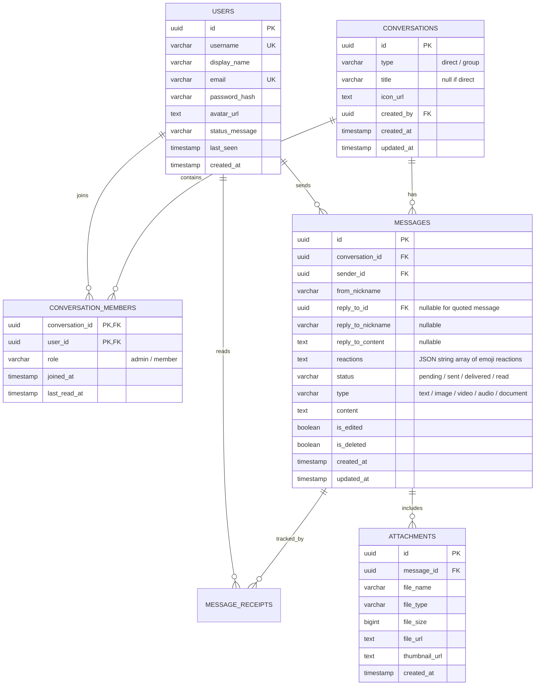

# Spesifikasi Desain Arsitektur & Database — Wuzz Chat

Dokumen ini mendefinisikan desain skema data, alur komunikasi WebSocket, dan standar API untuk evolusi platform **Wuzz Chat** menuju aplikasi chatting modern kelas WhatsApp/Telegram.

---

## 🗄️ 1. Skema Database Relasional (PostgreSQL / Supabase)

Untuk mendukung percakapan berkelanjutan (*Direct Message & Group*), daftar kontak, profil pengguna, dan tanda terima pesan (*read receipts*), skema database dirancang sebagai berikut:



---

## 📡 2. Protokol Komunikasi WebSocket (Payload Standard & Autentikasi)

### A. Handshake Autentikasi (`/ws`)
Koneksi WebSocket mewajibkan autentikasi token JWT sebelum upgrade connection dilakukan. Token dapat dikirimkan melalui parameter query `?token=<jwt>` atau header `Authorization: Bearer <jwt>`.
- Jika token tidak valid atau tidak disertakan ➔ Server merespons `401 Unauthorized`.
- Jika token valid ➔ Server melakukan upgrade ke WebSocket dan secara otomatis mengikat identitas koneksi (`ClientID` = `claims.UserID`, `Nickname` = `claims.DisplayName` / `claims.Username`) tanpa celah pemalsuan nickname.

### B. Format Amplop Pesan (Payload Envelope)
```json
{
  "id": "uuid-v4-event",
  "type": "message | typing | receipt | reaction | room_users | history | system",
  "room": "dm_xxx / room-xxx",
  "from": "uuid-sender",
  "nickname": "Alice",
  "content": "Isi pesan...",
  "status": "pending | sent | delivered | read",
  "reply_to": {
    "id": "uuid-quoted-msg",
    "nickname": "Bob",
    "content": "Pesan yang dibalas"
  },
  "reactions": [
    { "emoji": "❤️", "users": ["Alice"], "count": 1 }
  ],
  "timestamp": "2026-09-12T03:00:00Z"
}
```

### B. Daftar Tipe Event:
| Event Type | Arah | Penjelasan |
|---|---|---|
| `message` | Bidirectional | Pengiriman dan penerimaan pesan teks/media |
| `typing` | Bidirectional | Notifikasi bahwa user sedang mengetik di obrolan |
| `receipt` | Bidirectional | Laporan status pesan (`sent`, `delivered`, `read`) secara single atau bulk room |
| `reaction`| Bidirectional | Toggle penambahan/penghapusan reaksi emoji pada pesan |
| `room_users`| Server ➔ Client | Daftar anggota aktif dalam satu obrolan (presence realtime) |
| `history` | Server ➔ Client | Pengiriman riwayat pesan persisten saat user join ke obrolan |
| `join` | Client ➔ Server | Permintaan bergabung ke room tertentu dengan nickname/identitas |

---

## 🔐 3. Standar API & Autentikasi (REST Endpoints)

| Method | Endpoint | Fungsi | Auth |
|---|---|---|---|
| `POST` | `/api/auth/register` | Pendaftaran akun user baru | Public |
| `POST` | `/api/auth/login` | Login dan generate JWT token | Public |
| `GET` | `/api/auth/me` | Mengambil profil user yang sedang login | Bearer Token |
| `PUT` | `/api/auth/profile` | Memperbarui display name, status bio, dan avatar | Bearer Token |
| `GET` | `/api/users/search?q=` | Mencari user berdasarkan username/nama | Bearer Token |
| `GET` | `/api/conversations` | Daftar obrolan aktif beserta pesan terakhir | Bearer Token |
| `POST` | `/api/conversations` | Membuat obrolan baru (Direct atau Group) | Bearer Token |
| `GET` | `/api/conversations/:id/messages` | Mengambil riwayat pesan berpaginasi | Bearer Token |
| `POST` | `/api/media/upload` | Upload file gambar/dokumen/audio ke storage | Bearer Token |

