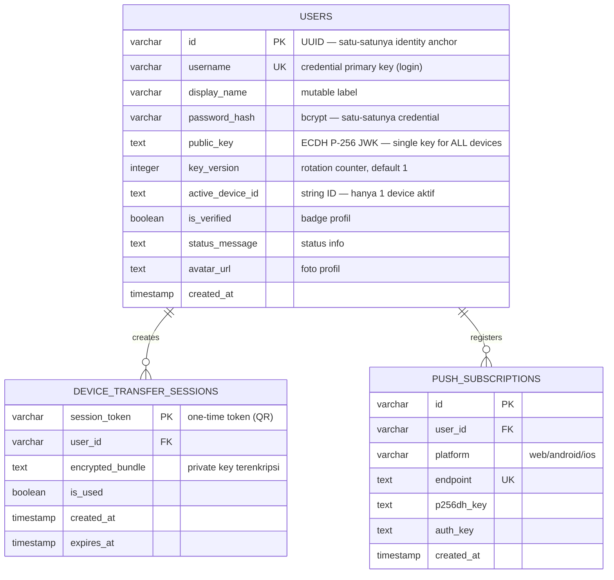
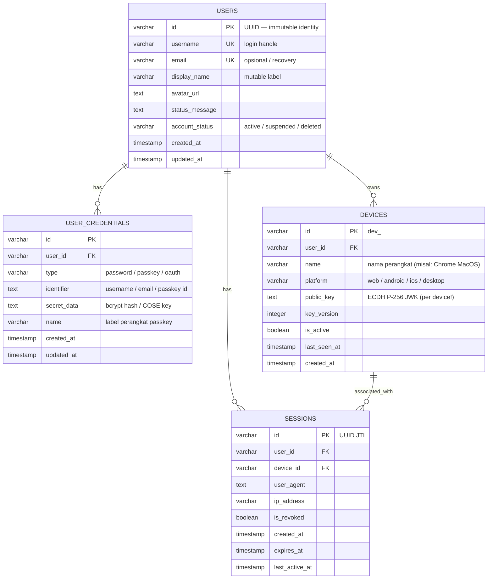

# 🔍 WuzzChat — Architecture Audit & Identity Evolution Roadmap
**Fokus:** Identity · Authentication · Device Management · Session Management · Multi-Device & Passkey Readiness  
**Tanggal:** 21–22 September 2026  
**Status:** **Phase 0, Phase 1, Phase 2, & Phase 5 SELESAI ✅** | Roadmap Identitas & Multi-Device WuzzChat  

---

## 📌 Eksekutif Ringkasan

Dokumen ini merupakan hasil audit komprehensif arsitektur identitas, autentikasi, manajemen perangkat, dan sesi pada aplikasi **WuzzChat** (Backend Golang + Frontend Next.js 16). Dokumen ini berfungsi sebagai **cetak biru (*blueprint*) dan panduan migrasi bertahap (*non-destructive phased migration*)** untuk mewujudkan kapabilitas modern:
- Manajemen Sesi Multi-Perangkat (*Active Sessions & Remote Revocation*)
- Arsitektur Kredensial Fleksibel (Mendukung Passkey / WebAuthn / FIDO2)
- Pemulihan Akun Mandiri (*Account Recovery*)
- Arsitektur Kriptografi E2EE Multi-Device yang Matang

---

## Bagian 1 — Current Architecture (Baseline)

### 1.1 Entity Map (Baseline Awal)



> **Catatan Arsitektur:** Pada baseline awal, tidak ada tabel `sessions`, `devices`, atau `credentials` independen. Seluruh atribut identitas, kredensial, perangkat, dan status E2EE terkonsentrasi di tabel `users`.

---

### 1.2 JWT / Session Structure

```go
// auth/jwt.go
type UserClaims struct {
    UserID      string // users.id (UUID)
    Username    string // untuk display, embedded di token
    DisplayName string // untuk display, embedded di token
    jwt.RegisteredClaims
    // ExpiresAt: 7 hari fixed
    // Issuer:    "wuzz-chat"
    // Algoritma: HS256 (shared secret, env JWT_SECRET)
}
```

**Karakteristik JWT:**
| Properti | Nilai Baseline Awal | Peningkatan Pasca Phase 0 |
|---|---|---|
| Algoritma | HMAC-SHA256 (`HS256`) | `HS256` |
| Masa Hidup | 7 hari fixed | 7 hari fixed |
| Secret | Env variable (`JWT_SECRET`) | Env variable |
| Storage Klien | `localStorage` | `localStorage` |
| Token ID (JTI) | ❌ Tidak ada | ✅ UUID JTI (`claims.ID`) |
| Revocation List | ❌ Tidak ada | ✅ In-memory cache + DB table `revoked_tokens` |
| Global User Revoke | ❌ Tidak ada | ✅ `user_token_revocations` (saat ganti password) |
| Device Binding | ❌ Token tidak mengikat device_id | ❌ Masih independen (target Phase 1) |

---

### 1.3 Device Management (Kondisi Saat Ini)

```text
users.active_device_id = "" (kosong) | "dev_<uuid>" (satu device)
```

**Konsep:**
- Hanya 1 perangkat yang dapat berstatus "aktif" pada satu waktu.
- `active_device_id` diset saat `UpdatePublicKeyWithDevice()`.
- `active_device_id` dikosongkan saat `Logout()` (`ClearActiveDevice()`).
- Device ID dibuat di sisi klien: `localStorage.getItem('wuzz_device_id')` → format `dev_` + UUID v4.

**Alur Device Transfer (QR Code):**
```text
Device Lama                    Server                    Device Baru
     │                           │                           │
     │── POST /transfer/create ──►│                           │
     │   (encrypted_bundle)       │── store session_token ──►│
     │                           │                           │
     │         QR Code ──────────────────────────────────►   │
     │                           │                           │
     │                           │◄── POST /transfer/consume ─│
     │                           │    (session_token, new_dev)│
     │                           │── update active_device_id ─►│
     │                           │── mark is_used = TRUE ─────►│
```

---

### 1.4 Peta File Kunci

| Komponen | Lokasi File | Tanggung Jawab |
|---|---|---|
| Auth JWT | [`backend/internal/auth/jwt.go`](file:///home/bms-del112/BMS/personal-project/wuzz-chat/backend/internal/auth/jwt.go) | Pembuatan & parsing JWT Claims, JTI generator |
| Auth Middleware | [`backend/internal/auth/middleware.go`](file:///home/bms-del112/BMS/personal-project/wuzz-chat/backend/internal/auth/middleware.go) | `RequireJWT` & validasi pencabutan token |
| Validator | [`backend/internal/auth/validator.go`](file:///home/bms-del112/BMS/personal-project/wuzz-chat/backend/internal/auth/validator.go) | Validasi panjang & karakter username / password |
| Handlers Auth | [`backend/internal/api/auth_handler.go`](file:///home/bms-del112/BMS/personal-project/wuzz-chat/backend/internal/api/auth_handler.go) | Register, Login, Logout, VerifyPassword, ChangePassword, ResetPublicKey |
| User Store | [`backend/internal/store/user_store.go`](file:///home/bms-del112/BMS/personal-project/wuzz-chat/backend/internal/store/user_store.go) | Operasi database user, validasi password, E2EE key |
| Token Store | [`backend/internal/store/token_store.go`](file:///home/bms-del112/BMS/personal-project/wuzz-chat/backend/internal/store/token_store.go) | Blacklist JTI & pencabutan sesi global dengan fast-path memory cache |
| SQL Engine | [`backend/internal/store/sql.go`](file:///home/bms-del112/BMS/personal-project/wuzz-chat/backend/internal/store/sql.go) | Skema DDL auto-migration (PostgreSQL & SQLite) |
| WebSocket Handler | [`backend/internal/ws/handler.go`](file:///home/bms-del112/BMS/personal-project/wuzz-chat/backend/internal/ws/handler.go) | Autentikasi WebSocket handshake & gatekeeper `active_device_id` |
| Frontend Auth | [`frontend/lib/auth-context.tsx`](file:///home/bms-del112/BMS/personal-project/wuzz-chat/frontend/lib/auth-context.tsx) | State management login, token storage, synchronized logout |
| Frontend API | [`frontend/lib/api.ts`](file:///home/bms-del112/BMS/personal-project/wuzz-chat/frontend/lib/api.ts) | Request wrapper & safe 401 handling |
| Key Store | [`frontend/lib/crypto/keyStore.ts`](file:///home/bms-del112/BMS/personal-project/wuzz-chat/frontend/lib/crypto/keyStore.ts) | Manajemen IndexedDB private key, reset key re-auth |

---

## Bagian 2 — Gap Analysis & Coupling Matrix

### 2.1 Pemetaan Kondisi Baseline vs Target Ideal

```text
Target Architecture                  Status Terkini
─────────────────────────────────────────────────────────────
User
├── Identity                         ⚠️ Partial (UUID + username)
│   ├── UUID (immutable)             ✅ Ada — users.id
│   ├── Username (login handle)      ✅ Ada — users.username
│   ├── Email                        ❌ Belum ada di skema
│   ├── Phone Number                 ❌ Belum ada
│   └── is_verified                  ✅ Ada badge (users.is_verified)
│
├── Authentication                   ✅ Diperkuat (Phase 0)
│   ├── Password Credential          ✅ Ada — password_hash di tabel users
│   ├── Passkey / WebAuthn           ❌ Belum ada (Target Phase 4)
│   ├── OAuth / SSO                  ❌ Belum ada
│   ├── Change Password              ✅ Ada — POST /api/auth/change-password
│   ├── Re-Auth Gate                 ✅ Ada — POST /api/auth/verify-password
│   ├── Token Revocation             ✅ Ada — revoked_tokens & user_token_revocations
│   └── Reset Password (Recovery)    ❌ Belum ada flow email/recovery token
│
├── Device                           ⚠️ Embedded di tabel users (Single Device)
│   ├── Device Registry (table)      ❌ Belum ada tabel devices terpisah
│   ├── active_device_id             ✅ Ada — single-string di users
│   ├── Multi-Device Support         ❌ Belum ada (Target Phase 2 & 5)
│   ├── Device Metadata              ❌ Belum ada (nama, OS, platform, last_seen)
│   ├── Device Transfer (QR)         ✅ Ada — device_transfer_sessions
│   └── Remote Device Revoke         ❌ Belum ada
│
└── Session                          ⚠️ In-Memory / Blacklist Token Only
    ├── Session Table                ❌ Belum ada tabel sessions (Target Phase 1)
    ├── Refresh Token                ❌ Belum ada (JWT fixed 7 hari)
    ├── Session Expiry & Revoke      ✅ Ada via JTI Revocation
    └── Concurrent Session Limit     ❌ Belum ada
```

---

### 2.2 Masalah Coupling yang Wajib Diurai Secara Bertahap

```text
┌──────────────────────────────────────────────────────────────────┐
│  Tabel USERS (Baseline Awal)                                     │
│  ┌─────────────┐  ┌──────────────┐  ┌──────────────────────┐   │
│  │  Identity   │  │ Credential   │  │  Device/E2EE State   │   │
│  │  id         │  │ password_hash│  │  public_key          │   │
│  │  username   │  │ (implicit)   │  │  key_version         │   │
│  │  display_n. │  └──────────────┘  │  active_device_id    │   │
│  │  is_verified│                    └──────────────────────┘   │
│  └─────────────┘                                                 │
│           ↑                                                      │
│    Semua tercampur dalam satu tabel!                             │
└──────────────────────────────────────────────────────────────────┘
```

1. **Identity ↔ Credential Coupling**: `password_hash` menempel langsung di `users`. Menambah WebAuthn/Passkey memerlukan tabel `user_credentials` agar satu user dapat memiliki banyak metode login.
2. **Identity ↔ Device Coupling**: `active_device_id` dan `public_key` berada di `users`. Mengakibatkan satu akun hanya bisa memiliki satu perangkat dan satu pasangan kunci.
3. **E2EE Single Key Bottleneck**: Kunci publik menempel pada entitas pengguna, bukan entitas perangkat. Untuk mendukung laptop dan HP aktif bersamaan membaca pesan terenkripsi, kunci publik wajib berelasi per-perangkat (*per-device keypair*).

---

### 2.3 Matriks Risiko Teknis

| ID | Risiko | Severity | Dampak | Status Mitigasi |
|---|---|---|---|---|
| **R1** | **JWT stateless tanpa pencabutan** | 🔴 High | Token lama tetap valid setelah logout | **TERATASI (Phase 0)** via `revoked_tokens` + JTI |
| **R2** | **ForceResetPublicKey tanpa re-auth** | 🔴 High | Token curian dapat memutus perangkat asli | **TERATASI (Phase 0)** via password verification gate |
| **R3** | **Tidak ada fitur ganti password** | 🔴 High | Akun tidak bisa diamankan jika kredensial bocor | **TERATASI (Phase 0)** via `change-password` + token revoke |
| **R4** | **Single device architecture di tabel users** | 🟠 Medium | Memblokir integrasi multi-device | Dijadwalkan di **Phase 2** |
| **R5** | **Tidak ada session inventory** | 🟡 Low | Pengguna tidak bisa melihat daftar sesi aktif | Dijadwalkan di **Phase 1** |
| **R6** | **Tidak ada mekanisme account recovery** | 🔴 High | Lupa password mengakibatkan kehilangan akun permanen | Dijadwalkan di **Recovery Plan** |
| **R7** | **Single shared secret HS256** | 🟠 Medium | Kebocoran secret env memicu pemalsuan token global | Dijadwalkan di **Phase 1** (migrasi asimetris/rotasi secret) |
| **R8** | **Public key per-user bukan per-device** | 🔴 High | E2EE tidak bisa berjalan multi-device serentak | Dijadwalkan di **Phase 5** |

---

## Bagian 3 — Target Architecture & Migration Plan

### 3.1 Target Entity Map Ideal (Masa Depan)



---

### 3.2 Roadmap Bertahap (Non-Destructive Execution Plan)

#### 🏁 Phase 0 — Identity & Auth Hardening (STATUS: SELESAI ✅ — 21 Sept 2026)

> **Tujuan:** Menutup celah keamanan kritis tanpa breaking change pada API publik maupun schema utama.

1. **Pencabutan Token JWT (R1)**:
   - DDL non-destruktif: `revoked_tokens` dan `user_token_revocations` di [`backend/internal/store/sql.go`](file:///home/bms-del112/BMS/personal-project/wuzz-chat/backend/internal/store/sql.go).
   - `TokenStore` terintegrasi dengan `sync.Map` in-memory cache di [`backend/internal/store/token_store.go`](file:///home/bms-del112/BMS/personal-project/wuzz-chat/backend/internal/store/token_store.go).
   - Penyematan JTI UUID pada setiap klaim JWT di [`backend/internal/auth/jwt.go`](file:///home/bms-del112/BMS/personal-project/wuzz-chat/backend/internal/auth/jwt.go).
   - Middleware `RequireJWT` memblokir token yang telah dicabut (Status 401 Unauthorized).
   - Pembersihan otomatis token kedaluwarsa via background worker berkala 1 jam.
2. **Re-Autentikasi Reset Kunci E2EE (R2)**:
   - `POST /api/users/public-key/reset` mewajibkan kolom `password` dan divalidasi dengan hash bcrypt pengguna.
   - Endpoint pre-check `POST /api/auth/verify-password`.
3. **Fitur Ganti Password (R3)**:
   - Endpoint `POST /api/auth/change-password` memvalidasi password lama, kekuatan password baru (6–128 karakter), dan otomatis mencabut seluruh sesi token aktif pengguna (`RevokeAllUserTokens`).
4. **Sinkronisasi Frontend & UI**:
   - Safe 401 interceptor di [`frontend/lib/api.ts`](file:///home/bms-del112/BMS/personal-project/wuzz-chat/frontend/lib/api.ts).
   - Password prompt pada [`frontend/app/chat/DeviceConflictModal.tsx`](file:///home/bms-del112/BMS/personal-project/wuzz-chat/frontend/app/chat/DeviceConflictModal.tsx).
   - Form ganti password di tab Keamanan [`frontend/app/chat/ProfileModal.tsx`](file:///home/bms-del112/BMS/personal-project/wuzz-chat/frontend/app/chat/ProfileModal.tsx).
   - Live deploy ke Fly.io (`https://wuzz-chat-backend.fly.dev`) terverifikasi HTTP 200 OK.

---

#### 🛠️ Phase 1 — Session Foundation (STATUS: SELESAI ✅)

> **Tujuan:** Server mulai mencatat inventaris sesi login secara terpusat (*Stateful Session Tracking*) tanpa memutus klien JWT yang ada.

**Skema SQL:**
```sql
-- Migration Phase 1: Sessions Table (PostgreSQL & SQLite)
CREATE TABLE IF NOT EXISTS sessions (
    id VARCHAR(64) PRIMARY KEY,              -- JTI dari JWT
    user_id VARCHAR(64) NOT NULL,
    device_id TEXT DEFAULT '',               -- device_id saat login
    user_agent TEXT DEFAULT '',
    ip_address VARCHAR(45) DEFAULT '',
    is_revoked BOOLEAN DEFAULT FALSE,
    created_at TIMESTAMP NOT NULL,
    expires_at TIMESTAMP NOT NULL,
    last_active_at TIMESTAMP NOT NULL
);

CREATE INDEX IF NOT EXISTS idx_sessions_user ON sessions(user_id, is_revoked);
CREATE INDEX IF NOT EXISTS idx_sessions_expires ON sessions(expires_at);
```

**Spesifikasi Perubahan Teknis:**
1. **Login Hook**: Saat login berhasil, backend melakukan `INSERT INTO sessions` dengan `id = claims.ID (JTI)`.
2. **Session Inventory API**:
   - `GET /api/auth/sessions`: Menampilkan daftar sesi aktif pengguna (User Agent, IP, waktu login, status sesi saat ini).
   - `DELETE /api/auth/sessions/:id`: Mencabut sesi tertentu dari jarak jauh (*remote logout*).
3. **Middleware Sync**: `RequireJWT` memeriksa `sessions.is_revoked` secara terpadu.

---

#### 🔧 Phase 2 — Device Registry (STATUS: SELESAI ✅)

> **Tujuan:** Memisahkan metadata dan state perangkat dari tabel `users` ke tabel khusus `devices`, meletakkan fondasi multi-device.

**Skema SQL:**
```sql
-- Migration Phase 2: Devices Table (PostgreSQL & SQLite)
CREATE TABLE IF NOT EXISTS devices (
    id VARCHAR(64) PRIMARY KEY,              -- dev_<uuid>
    user_id VARCHAR(64) NOT NULL,
    name VARCHAR(128) DEFAULT '',            -- Contoh: "Chrome Windows", "Samsung Galaxy S24"
    platform VARCHAR(32) DEFAULT 'web',      -- web / android / ios / desktop
    public_key TEXT DEFAULT '',              -- ECDH P-256 JWK per-perangkat
    key_version INTEGER DEFAULT 1,
    is_active BOOLEAN DEFAULT TRUE,
    last_seen_at TIMESTAMP,
    created_at TIMESTAMP NOT NULL
);

CREATE INDEX IF NOT EXISTS idx_devices_user ON devices(user_id, is_active);
```

**Strategi Migrasi Data Non-Destructive:**
1. Buat tabel `devices` tanpa menghapus kolom lama di `users`.
2. **Backfill**: Migrasikan baris yang memiliki `users.active_device_id != ''` ke tabel `devices`.
3. Gunakan strategi **Dual-Write / Read Fallback**: Backend membaca dari `devices`, jika kosong fallback ke `users.active_device_id`.
4. Endpoint baru:
   - `GET /api/auth/devices`: Daftar perangkat terdaftar milik pengguna.
   - `DELETE /api/auth/devices/:id`: Hapus perangkat dan putus koneksi WebSocket perangkat tersebut.

---

#### 🔑 Phase 3 — Credential Separation (STATUS: SIAP DIEKSEKUSI)

> **Tujuan:** Memisahkan penyimpanan kredensial dari tabel profil `users`, membuka jalan untuk banyak metode login (Passkey, SSO, OTP).

**Skema SQL:**
```sql
-- Migration Phase 3: User Credentials Table
CREATE TABLE IF NOT EXISTS user_credentials (
    id VARCHAR(64) PRIMARY KEY,
    user_id VARCHAR(64) NOT NULL,
    type VARCHAR(32) NOT NULL,               -- 'password' | 'passkey' | 'oauth'
    identifier TEXT DEFAULT '',              -- username / email / credential_id
    secret_data TEXT NOT NULL,               -- bcrypt hash atau public key blob
    name VARCHAR(128) DEFAULT '',            -- Label ramah pengguna (misal: "Password Utama")
    created_at TIMESTAMP NOT NULL,
    updated_at TIMESTAMP NOT NULL
);

CREATE INDEX IF NOT EXISTS idx_credentials_user ON user_credentials(user_id, type);
CREATE INDEX IF NOT EXISTS idx_credentials_ident ON user_credentials(identifier);
```

**Strategi Migrasi:**
1. Buat tabel `user_credentials`.
2. Backfill: `INSERT INTO user_credentials (id, user_id, type, identifier, secret_data, name, created_at, updated_at) SELECT id, id, 'password', username, password_hash, 'Password Akun', created_at, created_at FROM users;`
3. Dual-read pada handler autentikasi sampai seluruh query diverifikasi stabil.

---

#### 🔐 Phase 4 — Passkey / WebAuthn / FIDO2 (STATUS: SIAP DIEKSEKUSI SETELAH PHASE 3)

> **Tujuan:** Login biometrik instan tanpa password (Touch ID / Face ID / Windows Hello) menggunakan standar W3C WebAuthn.

**Skema SQL:**
```sql
-- Migration Phase 4: Passkey Credentials Table
CREATE TABLE IF NOT EXISTS passkey_credentials (
    id VARCHAR(64) PRIMARY KEY,
    user_id VARCHAR(64) NOT NULL,
    credential_id TEXT NOT NULL UNIQUE,      -- WebAuthn Credential ID (Base64URL)
    public_key TEXT NOT NULL,                -- COSE encoded public key
    sign_count INTEGER DEFAULT 0,            -- Replay attack counter
    aaguid TEXT DEFAULT '',                  -- Authenticator Attestation GUID
    transports TEXT DEFAULT '[]',            -- JSON array: ["internal", "usb", "ble"]
    name VARCHAR(128) DEFAULT '',            -- Label: "MacBook Touch ID"
    created_at TIMESTAMP NOT NULL,
    last_used_at TIMESTAMP
);

CREATE INDEX IF NOT EXISTS idx_passkeys_user ON passkey_credentials(user_id);
```

**Endpoint Desain:**
- `POST /api/auth/passkeys/register/start`: Menghasilkan WebAuthn creation options (challenge, RP info).
- `POST /api/auth/passkeys/register/finish`: Memvalidasi attestation response & menyimpan kredensial.
- `POST /api/auth/passkeys/login/start`: Menghasilkan assertion options untuk autentikasi biometrik.
- `POST /api/auth/passkeys/login/finish`: Memverifikasi tanda tangan kriptografi COSE & menerbitkan JWT.

---

#### 🔄 Phase 5 — Multi-Device E2EE Continuity (STATUS: SELESAI ✅)

> **Tujuan:** Mengizinkan beberapa perangkat fisik (Laptop & HP) milik pengguna yang sama dapat membaca obrolan E2EE secara serentak.

**Pilihan Arsitektur Kriptografi:**
1. **Per-Device Recipient Fan-Out (Signal Protocol Pattern)**:
   - Setiap perangkat memiliki pasangan kunci ECDH independen yang tercatat di tabel `devices`.
   - Pengirim pesan mengenkripsi payload dengan kunci masing-masing perangkat penerima ($N$ perangkat = $N$ ciphertext tersimpan di server).
   - Keuntungan: Keamanan kriptografi murni, tidak ada pertukaran private key antar perangkat.
2. **Master Key Sync via Secure QR Transfer (Current Enhanced Pattern)**:
   - Kunci identitas utama tetap disinkronkan saat pertama kali menghubungkan perangkat baru via QR scan terenkripsi (`device_transfer_sessions`).
   - Setiap perangkat mempertahankan sub-sesi aktifnya sendiri di server.

---

## Bagian 4 — Rencana Pemulihan Akun (Account Recovery Plan)

Saat ini, jika pengguna lupa password, akun tidak dapat dipulihkan. Rencana pemulihan disusun bertahap:

1. **Email Recovery Channel (Fase Transisi)**:
   - Tambahkan kolom `email VARCHAR(255)` dan `is_email_verified BOOLEAN` pada tabel `users`.
   - Endpoint `POST /api/auth/forgot-password` → generate one-time token 15 menit dengan hashing SHA-256.
   - Endpoint `POST /api/auth/reset-password` → verifikasi token & ubah password.
2. **Offline Backup Recovery Codes**:
   - Hasilkan 8–10 kode pemulihan satu kali pakai saat pendaftaran akun.
   - Simpan hash bcrypt dari kode-kode tersebut di tabel `account_recovery_tokens`.
3. **Passkey sebagai Jangkar Recovery**:
   - Jika pengguna lupa password, passkey biometrik yang telah didaftarkan pada perangkat terpercaya dapat digunakan untuk me-reset password secara aman.

---

## Bagian 5 — Daftar Endpoint Tambahan (API Registry)

| Prioritas | Endpoint | Method | Fungsi | Status |
|---|---|---|---|---|
| 🔴 **P0** | `/api/auth/change-password` | POST | Ganti password & revoke token lama | **SELESAI ✅** |
| 🔴 **P0** | `/api/auth/verify-password` | POST | Re-autentikasi password sebelum aksi kritis | **SELESAI ✅** |
| 🔴 **P0** | `/api/users/public-key/reset` | POST | Reset kunci E2EE dengan proteksi password | **SELESAI ✅** |
| 🟠 **P1** | `/api/auth/sessions` | GET | List daftar sesi aktif pengguna | **SELESAI ✅** |
| 🟠 **P1** | `/api/auth/sessions/:id` | DELETE | Cabut sesi perangkat tertentu secara remote | **SELESAI ✅** |
| 🟠 **P1** | `/api/auth/forgot-password` | POST | Minta token reset password via email | Siap dieksekusi |
| 🟠 **P1** | `/api/auth/reset-password` | POST | Reset password menggunakan token recovery | Siap dieksekusi |
| 🟡 **P2** | `/api/auth/devices` | GET | List perangkat terdaftar milik pengguna | **SELESAI ✅** |
| 🟡 **P2** | `/api/auth/devices/:id` | DELETE | Hapus perangkat & putus koneksi WebSocket | **SELESAI ✅** |
| 🟡 **P3** | `/api/auth/passkeys/register/start` | POST | Mulai pendaftaran Passkey WebAuthn | Siap dieksekusi |
| 🟡 **P3** | `/api/auth/passkeys/register/finish` | POST | Selesaikan pendaftaran Passkey WebAuthn | Siap dieksekusi |
| 🟡 **P3** | `/api/auth/passkeys/login/start` | POST | Mulai autentikasi login Passkey | Siap dieksekusi |
| 🟡 **P3** | `/api/auth/passkeys/login/finish` | POST | Verifikasi login Passkey & terbitkan JWT | Siap dieksekusi |

---

## 📌 Ringkasan Status Eksekusi

```text
[Phase 0: Quick Wins] ──────────► [SELESAI ✅] (JWT Revocation, Safe Re-Auth, Change Password)
        │
        ▼
[Phase 1: Session Foundation] ──► [SELESAI ✅] (Sessions Table, Active Inventory & Remote Logout)
        │
        ▼
[Phase 2: Device Registry] ─────► [SELESAI ✅] (Devices Table, Multi-Device WS Hub, FIFO Eviction)
        │
        ▼
[Phase 3: Credential Split] ────► [TERDOKUMENTASI & SIAP DIEKSEKUSI] (Multi-Credential Table)
        │
        ▼
[Phase 4: Passkey / WebAuthn] ──► [TERDOKUMENTASI & SIAP DIEKSEKUSI] (FIDO2 Biometric Login)
        │
        ▼
[Phase 5: Multi-Device E2EE] ───► [SELESAI ✅] (Shared Master Key Pattern via QR Sync & Key-Matching)
                                  [Phase 5B Roadmap]: Per-Device Signal Fanout Architecture
```
