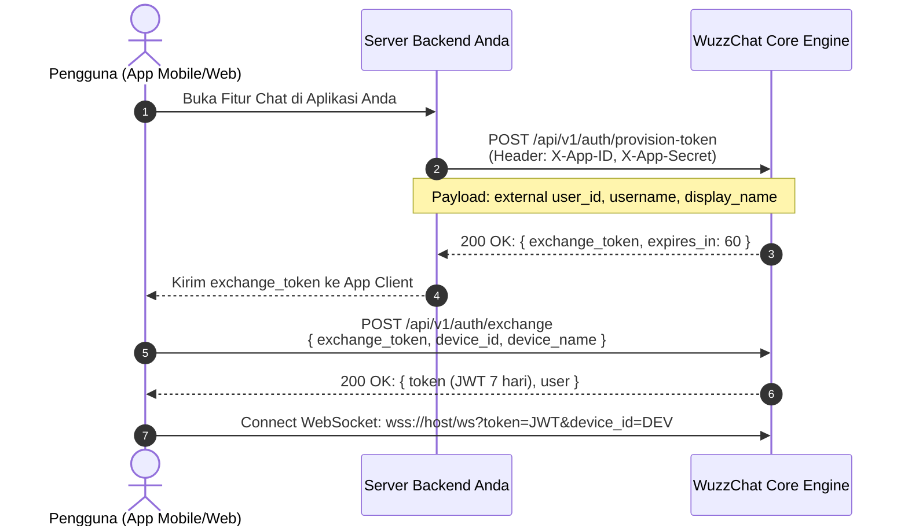

# WuzzChat Engine — Headless B2B Integration Guide

Panduan integrasi teknis resmi bagi mitra B2B, platform eksternal, dan pengembang mobile/frontend independen untuk mengintegrasikan mesin perpesanan real-time, zero-knowledge E2EE, dan AI Memory Engine WuzzChat ke dalam sistem aplikasi Anda.

---

## 📑 Daftar Isi
1. [Arsitektur Headless & Multi-Tenancy](#1-arsitektur-headless--multi-tenancy)
2. [Alur Autentikasi B2B (JIT Provisioning & Token Exchange)](#2-alur-autentikasi-b2b-jit-provisioning--token-exchange)
3. [Koneksi Real-time WebSocket (RFC 6455)](#3-koneksi-real-time-websocket-rfc-6455)
4. [Katalog Event & Format Wire Frame](#4-katalog-event--format-wire-frame)
5. [Standar Enkripsi End-to-End (Zero-Knowledge E2EE)](#5-standar-enkripsi-end-to-end-zero-knowledge-e2ee)
6. [Siklus Hidup Ephemeral Fora & AI Memory Engine](#6-siklus-hidup-ephemeral-fora--ai-memory-engine)
7. [Penanganan Error (RFC 7807) & Ketahanan Jaringan](#7-penanganan-error-rfc-7807--ketahanan-jaringan)
8. [Checklist Produksi Klien B2B](#8-checklist-produksi-klien-b2b)

---

## 1. Arsitektur Headless & Multi-Tenancy

WuzzChat Engine dirancang dengan prinsip **Headless Decoupled Architecture**:
- **Backend Core**: Berjalan mandiri di Go, mengelola status koneksi socket, persistensi pesan terenkripsi, sinkronisasi multi-device, isolasi tenant, serta orkestrasi AI Memory.
- **Frontend / Client Apps**: Bebas dibangun menggunakan teknologi apa pun (Next.js, React Native, Flutter, Swift iOS, Kotlin Android, Desktop Electron) tanpa keterikatan pada UI default WuzzChat.

### 1.1 Base URLs
| Lingkungan | HTTP REST API | WebSocket URL | Keterangan |
| :--- | :--- | :--- | :--- |
| **Live Production** | `https://wuzz-chat-backend.fly.dev` | `wss://wuzz-chat-backend.fly.dev/ws` | Fly.io Global Anycast |
| **Local Development** | `http://localhost:8080` | `ws://localhost:8080/ws` | Dedicated Dev Instance |

### 1.2 Model Isolasi Tenant (Multi-Tenancy)
Setiap panggilan REST API dapat menyertakan header:
```http
X-Tenant-ID: your_tenant_slug
```
Aturan resolusi tenant backend:
1. Header `X-Tenant-ID` (Prioritas Utama).
2. Claim `tenant_id` dari JWT Bearer Token (jika user telah login).
3. Fallback default: `"default"`.

> ⚠️ **Isolasi Database Penuh**: Pengguna, room ID (`dm_<tenant>_<userA>_<userB>`), pesan, forum, dan draf memori AI diisolasi secara mutlak di tingkat query database. Dua tenant berbeda tidak dapat melihat atau berkomunikasi satu sama lain.

---

## 2. Alur Autentikasi B2B (JIT Provisioning & Token Exchange)

Untuk aplikasi pihak ketiga (misal: LMS, ERP, HR portal, aplikasi telemedisin), pengguna **tidak perlu registrasi manual**. Sistem Anda dapat melakukan **Just-In-Time (JIT) Provisioning** secara transparan.

### 2.1 Diagram Alur Autentikasi B2B



### 2.2 Langkah 1: Server-to-Server JIT Provisioning
Backend server Anda melakukan request HTTP POST ke WuzzChat:

**Endpoint**: `POST /api/v1/auth/provision-token`  
**Headers**:
- `X-App-ID: <YOUR_APP_ID>`
- `X-App-Secret: <YOUR_APP_SECRET>`
- `Content-Type: application/json`

**Request Body**:
```json
{
  "user_id": "usr_external_9921",
  "username": "budi_santoso",
  "display_name": "Budi Santoso, M.Kom",
  "avatar_url": "https://cdn.perusahaan.com/avatars/budi.jpg",
  "role": "member"
}
```

**Response (HTTP 200 OK)**:
```json
{
  "exchange_token": "ext_6f9a8b1c2d3e4f50...",
  "expires_in": 60
}
```

#### Contoh Implementasi Backend (Node.js / TypeScript):
```typescript
import axios from 'axios';

// Disarankan menggunakan environment variable, bukan hardcode URL
const WUZZ_BASE_URL = process.env.WUZZ_BACKEND_URL || 'https://wuzz-chat-backend.fly.dev';

async function getChatExchangeToken(user: { id: string; name: string; avatar: string }) {
  const response = await axios.post(
    `${WUZZ_BASE_URL}/api/v1/auth/provision-token`,
    {
      user_id: user.id,
      username: `user_${user.id}`,
      display_name: user.name,
      avatar_url: user.avatar,
    },
    {
      headers: {
        'X-App-ID': process.env.WUZZ_APP_ID!,
        'X-App-Secret': process.env.WUZZ_APP_SECRET!,
        'Content-Type': 'application/json',
      },
      timeout: 10000,
    }
  );

  return response.data.exchange_token as string;
}
```

### 2.3 Langkah 2: Client Token Exchange
Aplikasi frontend/mobile menukarkan `exchange_token` (berlaku 60 detik, *single-use*) menjadi sesi JWT 7 hari:

**Endpoint**: `POST /api/v1/auth/exchange`  
**Headers**: `Content-Type: application/json`

**Request Body**:
```json
{
  "exchange_token": "ext_6f9a8b1c2d3e4f50...",
  "device_id": "device_mobile_android_abc123",
  "device_name": "Samsung Galaxy S24"
}
```

**Response (HTTP 200 OK)**:
```json
{
  "token": "eyJhbGciOiJIUzI1NiIsInR5cCI6IkpXVCJ9...",
  "user": {
    "id": "usr_a1b2c3d4",
    "username": "budi_santoso",
    "display_name": "Budi Santoso, M.Kom",
    "avatar_url": "https://cdn.perusahaan.com/avatars/budi.jpg",
    "public_key": "MFkwEwYHKoZIzj0CAQYIKoZIzj0DAQcDQgAE...",
    "key_version": 1,
    "tenant_id": "tenant_perusahaan"
  },
  "expires_in": 604800
}
```

---

## 3. Koneksi Real-time WebSocket (RFC 6455)

Seluruh komunikasi real-time (pesan, status ketik, tanda terima centang, reaksi emoji, sinyal WebRTC, dan event draf memori AI) menggunakan WebSocket RFC 6455.

### 3.1 Handshake URL
```http
GET wss://<WUZZ_HOST>/ws?token=<SESSION_JWT>&device_id=<DEVICE_ID>
```
- `<WUZZ_HOST>`: Host backend Anda (misal `wuzz-chat-backend.fly.dev` di production, atau `localhost:8080` via `ws://` saat dev lokal).
- `token`: JWT hasil dari pertukaran token atau login.
- `device_id`: Identifier unik perangkat klien (misal: UUID di simpanan lokal `SecureStore` / `localStorage`). Digunakan untuk isolasi multi-device.

### 3.2 Kuota Perangkat & Penanganan `SESSION_REPLACED` (Close Code `4001`)
Backend menerapkan batas **2 perangkat aktif bersamaan** (Level 2 Multi-Device).
- Jika perangkat ke-3 membuka koneksi WebSocket, server akan mengeksekusi **FIFO Eviction** terhadap perangkat tertua.
- Perangkat tertua akan menerima frame:
  ```json
  {
    "type": "system",
    "from": "server",
    "content": "SESSION_REPLACED: Akun Anda dibuka dari perangkat lain."
  }
  ```
- Koneksi kemudian ditutup dengan Close Code `4001: SESSION_REPLACED`.
- ⚠️ **Kaidah Reconnect Klien**: Ketika menerima Close Code `4001`, klien **DILARANG** melakukan auto-reconnect! Klien harus menghentikan loop reconnect dan menampilkan modal *"Sesi Anda telah digantikan oleh perangkat lain"*.

### 3.3 Heartbeat (Keep-Alive Ping/Pong)
- Server mengirimkan WebSocket Ping control frame setiap **30 detik**.
- Klien harus merespons Pong frame secara otomatis (kebanyakan library klien seperti browser native WebSocket / Dart IOWebSocketChannel menangani ini secara internal).
- Jika koneksi terputus mendadak, klien wajib menerapkan **Exponential Backoff**:
  `Interval = min(initialDelay * 2^attempt, maxDelay)` (misal: 1s, 2s, 4s, 8s, 16s, hingga 30s).

---

## 4. Katalog Event & Format Wire Frame

Semua pesan yang ditransmisikan melalui WebSocket berbentuk JSON.

### 4.1 Mengirim Pesan Teks / E2EE (`message`)
**Client ➔ Server**:
```json
{
  "type": "message",
  "room_id": "dm_tenantA_usr1_usr2",
  "content": "BASE64_CIPHERTEXT_OR_TEXT",
  "content_type": "text",
  "client_msg_id": "uuid-optimistic-1234",
  "reply_to_id": null
}
```

**Server Broadcast ➔ Room Participants**:
```json
{
  "id": "msg_db_998811",
  "type": "message",
  "room_id": "dm_tenantA_usr1_usr2",
  "sender_id": "usr1",
  "content": "BASE64_CIPHERTEXT_OR_TEXT",
  "content_type": "text",
  "status": "sent",
  "created_at": "2026-09-25T08:00:00Z"
}
```

### 4.2 Status Sedang Mengetik (`typing`)
**Client ➔ Server**:
```json
{
  "type": "typing",
  "room_id": "dm_tenantA_usr1_usr2",
  "is_typing": true
}
```

### 4.3 Tanda Terima Pesan / Receipts (`receipt`)
WuzzChat mendukung 3 status bertingkat:
1. `sent` (`✓` abu-abu): Pesan telah tersimpan di server database.
2. `delivered` (`✓✓` abu-abu): Pesan telah diterima oleh socket perangkat lawan.
3. `read` (`✓✓` biru): Pesan telah dibuka di layar aktif penerima.

**Client ➔ Server**:
```json
{
  "type": "receipt",
  "room_id": "dm_tenantA_usr1_usr2",
  "message_ids": ["msg_db_998811"],
  "status": "read"
}
```

### 4.4 Reaksi Emoji (`reaction`)
**Client ➔ Server**:
```json
{
  "type": "reaction",
  "room_id": "dm_tenantA_usr1_usr2",
  "message_id": "msg_db_998811",
  "emoji": "👍"
}
```

### 4.5 Notifikasi Publikasi AI Memory (`memory_approved`)
Ketika admin menyetujui draf memori AI untuk sebuah grup/forum, server menyiarkan event ini secara real-time ke seluruh anggota grup:

**Server ➔ Room Participants**:
```json
{
  "type": "memory_approved",
  "group_id": "grp_tech_summit",
  "memory_id": "mem_2026_09_25",
  "title": "Kesepakatan Arsitektur Multi-Tenancy 2026",
  "summary": "Diskusi final menetapkan penggunaan isolated schema dengan JIT token provisioning...",
  "published_at": "2026-09-25T08:15:00Z"
}
```

---

## 5. Standar Enkripsi End-to-End (Zero-Knowledge E2EE)

WuzzChat mengimplementasikan zero-knowledge E2EE standar industri kriptografi:
- **Kurva Kriptografi**: ECDH (Elliptic Curve Diffie-Hellman) pada kurva **NIST P-256** (`prime256v1`).
- **Key Derivation Function (KDF)**: HKDF-SHA256 dengan salt unik per percakapan.
- **Symmetric Cipher**: **AES-256-GCM** dengan initialization vector (IV) acak 12-byte per pesan.

```text
[Klien Pengirim]                                            [Klien Penerima]
1. Generate ECDH P-256 Keypair                              1. Generate ECDH P-256 Keypair
2. Unggah Public Key ke Server                              2. Unggah Public Key ke Server
3. Ambil Public Key Penerima                                3. Ambil Public Key Pengirim
4. Compute Shared Secret = ECDH(PrivA, PubB)                4. Compute Shared Secret = ECDH(PrivB, PubA)
5. Derive AES-256 Key via HKDF-SHA256                       5. Derive AES-256 Key via HKDF-SHA256
6. Enkripsi Plaintext via AES-GCM ➔ Server (Ciphertext) ➔ 6. Dekripsi Ciphertext via AES-GCM
```

> 🔒 **Jaminan Keamanan**: Server backend hanya menerima dan menyimpan `content` berupa Base64 ciphertext. Backend tidak memiliki akses ke private key pengguna dan tidak dapat membaca isi pesan maupun berkas media terenkripsi.

---

## 6. Siklus Hidup Ephemeral Fora & AI Memory Engine

### 6.1 Subgroup Ephemeral dengan TTL (Time-To-Live)
Mitra B2B dapat membuat forum diskusi sementara (misal: ruang koordinasi insiden, forum konsultasi proyek) yang kedaluwarsa secara otomatis.

1. **Pembuatan Subgroup**:
   `POST /api/groups/{group_id}/subgroups` dengan parameter `ttl_minutes: 180` (3 jam).
2. **Kunci Otomatis (Locking)**:
   Setelah 3 jam, background worker backend menandai forum sebagai `is_expired: true`. Pengguna tidak dapat lagi mengirimkan pesan baru.
3. **Trigger AI Memory Synthesis**:
   Penutupan forum memicu ekstraksi riwayat percakapan secara terisolasi ke worker AI untuk merangkum:
   - Keputusan Utama (*Decisions*)
   - Rencana Tindak Lanjut (*Action Items*)
   - Poin Penting (*Key Takeaways*)
   - Garis Waktu Diskusi (*Journey Lite*)

### 6.2 Siklus Human-in-the-Loop Review
Draf yang dihasilkan AI masuk ke antrean admin:
1. `GET /api/memory/drafts`: Admin melihat antrean draf yang menunggu telaah.
2. `PATCH /api/memory/drafts/{id}/artifacts/{art_id}`: Admin dapat mengoreksi rumusan kalimat atau mengubah status action items.
3. `POST /api/memory/drafts/{id}/approve`: Draf dipublikasikan ke perpustakaan memori anggota dan disiarkan via WebSocket (`memory_approved`).

---

## 7. Penanganan Error (RFC 7807) & Ketahanan Jaringan

Seluruh kegagalan request REST API disajikan dalam format standar **RFC 7807 Problem Details**:

```json
{
  "type": "https://wuzzhub.id/errors/forbidden",
  "title": "Forbidden",
  "status": 403,
  "detail": "Anda bukan anggota dari percakapan atau forum ini.",
  "instance": "/api/conversations/dm_tenant_1_2/messages"
}
```

### 7.1 Header Rate Limiting
Server menyertakan header kontrol beban pada setiap respons HTTP:
- `X-RateLimit-Limit`: Jumlah kuota request per jendela waktu (misal: 60 request/menit).
- `X-RateLimit-Remaining`: Sisa kuota panggilan API yang tersedia.
- `X-RateLimit-Reset`: Waktu epoch UNIX saat kuota di-reset.
- `Retry-After`: Waktu tunggu (dalam detik) jika terkena HTTP 429 Too Many Requests.

### 7.2 Slow & Flaky Network Resilience SOP
Klien eksternal wajib menerapkan:
1. **Optimistic UI**: Tampilkan pesan langsung di UI lokal sebelum respons server tiba.
2. **Managed Request Timeout**: Seluruh pemanggilan `fetch()` / HTTP wajib menyertakan `AbortController` dengan batas maksimal **15 detik** (query) atau **60 detik** (upload media).
3. **Double-Action Guard**: Kunci tombol aksi (*disabled*) seketika saat diklik untuk mencegah duplikasi transaksi pada latensi jaringan tinggi.

---

## 8. Checklist Produksi Klien B2B

Sebelum merilis integrasi aplikasi Anda ke lingkungan live production:
- [ ] Validasi bahwa kredensial `X-App-ID` dan `X-App-Secret` disimpan di server backend Anda, **bukan** di hardcode dalam file APK/IPA mobile client.
- [ ] Implementasikan penanganan WebSocket Close Code `4001: SESSION_REPLACED` untuk menghentikan auto-reconnect loop saat login di perangkat lain.
- [ ] Pastikan seluruh endpoint REST API menyertakan header `Authorization: Bearer <token>`.
- [ ] Terapkan penanganan HTTP 401 Unauthorized dengan me-redirect user ke alur token exchange baru.
- [ ] Konfigurasikan penyimpanan private key E2EE pada Secure Enclave / Keystore OS yang aman (bukan plaintext AsyncStorage).
