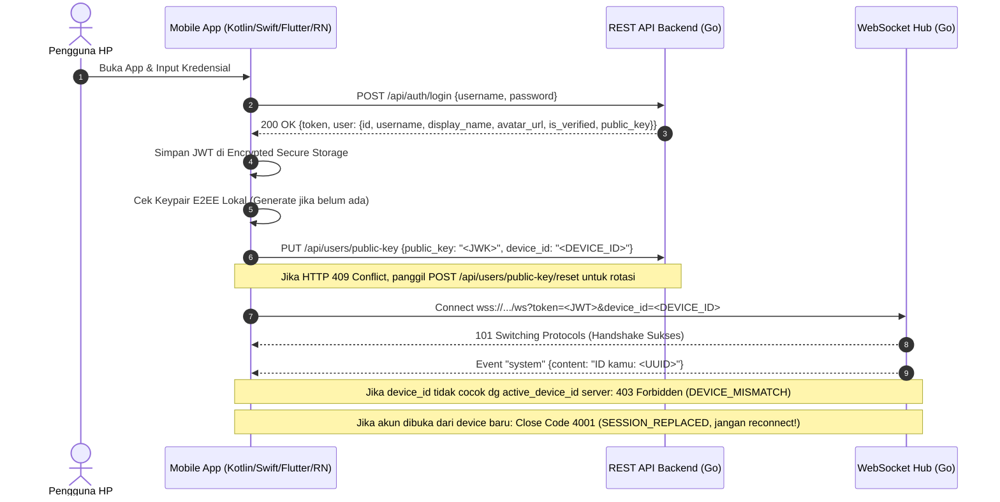

# Panduan Integrasi Klien Mobile (Android & iOS) — Wuzz Chat

Dokumen ini adalah panduan teknis komprehensif (*Mobile Client Integration Guide & Architecture Blueprint*) bagi engineer yang akan membangun aplikasi mobile native (**Android Kotlin**, **iOS Swift**) maupun cross-platform (**Flutter**, **React Native**) untuk ekosistem **Wuzz Chat**.

---

## 📱 1. Filosofi & Desain Platform-Agnostik

Backend **Wuzz Chat** (Golang) dan Database (Supabase PostgreSQL) dibangun dengan prinsip **Headless API & Platform Agnostic**:
- Tidak terikat pada teknologi frontend tertentu (Next.js hanya salah satu implementasi klien web).
- Menggunakan standar industri terbuka: **JSON over REST API**, **WebSocket (RFC 6455)**, dan **Web Crypto / NIST RFC Cryptography**.
- Pesan yang dikirim dari Android Native (Kotlin) dapat langsung didekripsi dan dibaca oleh iOS Native (Swift) maupun Web (Next.js) secara transparan.

---

## 📡 2. Layer Komunikasi & Jaringan

### A. Konfigurasi Endpoint Server
| Environment | REST API Base URL | WebSocket Endpoint |
|---|---|---|
| **Production (Live)** | `https://wuzz-chat-backend.fly.dev` | `wss://wuzz-chat-backend.fly.dev/ws?token=<JWT>&device_id=<DEVICE_ID>` |
| **Local Development** | `http://10.0.2.2:8080` (Android Emulator) / `http://localhost:8080` (iOS Sim) | `ws://10.0.2.2:8080/ws?token=<JWT>&device_id=<DEVICE_ID>` |

---

### B. Autentikasi & Session Lifecycle



1. **Login & Token Storage**:
   - Simpan token JWT di secure storage perangkat (**EncryptedSharedPreferences** di Android, **Keychain** di iOS).
2. **Push Notification Registration (FCM / APNs)**:
   - Setelah login, ambil token perangkat via `FirebaseMessaging.getInstance().getToken()` (Android) atau APNs (iOS).
   - Daftarkan token ke backend Go:
     ```http
     POST /api/notifications/subscribe
     Authorization: Bearer <JWT>
     Content-Type: application/json

     {
       "platform": "android",
       "endpoint": "https://fcm.googleapis.com/fcm/send/<FCM_REGISTRATION_TOKEN>"
     }
     ```
   - Saat logout, panggil `POST /api/notifications/unsubscribe` dengan body `{ "endpoint": "..." }`.
3. **Koneksi WebSocket**:
   - Selalu sertakan query `?token=<JWT>` saat inisialisasi socket.
   - Implementasikan **Exponential Backoff Auto-Reconnect** (1s, 2s, 4s, 8s, maks 30s) saat koneksi terputus (misal saat HP berganti jaringan dari WiFi ke 4G/5G).
4. **E2EE Key Management & Conflict Guard**:
   - Selalu sertakan `device_id` unik perangkat saat sinkronisasi `PUT /api/users/public-key`.
   - Jika menerima HTTP 409 Conflict (`KEY_ALREADY_REGISTERED`), tampilkan dialog konfirmasi apakah pengguna ingin mereset kunci ke perangkat ini via `POST /api/users/public-key/reset`.
   - Ini memastikan *Safety Number* 30-digit selalu konsisten antar perangkat dan percakapan.

---

### C. Spesifikasi Event WebSocket (Kamus Event Real-Time)

Setiap frame pesan WebSocket menggunakan format JSON:

> **🔑 UUID-First Identity Principle**: Field `from` selalu berisi **UUID immutable** pengirim yang di-*enforce* dari JWT server (bukan dari payload klien). Field `nickname` hanya sebagai display label. Semua logika identifikasi pengirim di klien mobile **wajib membandingkan `from` (UUID)** dengan UUID user yang sedang login — **jangan** gunakan `nickname`.

```json
{
  "id": "msg-uuid-v4",
  "type": "message",
  "room": "dm_5819a9c9_b06477ec",
  "from": "user-uuid-pengirim",
  "nickname": "Alice",
  "content": "e2ee:v1:<base64-iv>:<base64-cipher>",
  "status": "sent",
  "reply_to": {
    "id": "target-msg-id",
    "nickname": "Bob",
    "content": "Pesan yang dikutip"
  },
  "reactions": [
    { "emoji": "❤️", "users": ["uuid-user-1"], "count": 1 }
  ],
  "media_url": "https://...",
  "media_type": "image",
  "file_name": "foto.jpg",
  "file_size": 245000,
  "timestamp": "2026-09-14T01:00:00Z"
}
```

> **📌 `reactions.users`**: Array berisi **UUID pengguna** (bukan username). Klien mobile menentukan apakah user sudah bereaksi dengan cara: `reaction.users.contains(currentUser.id)`.

| Tipe Event (`type`) | Arah | Tindakan Klien Mobile |
|---|---|---|
| `join` | Klien ➔ Server | Masuk ke ruang chat: `{"type":"join", "room":"..."}` — identitas diambil dari JWT (UUID), tidak perlu kirim `nickname` |
| `message` | Bidirectional | Dekripsi konten teks (`e2ee:v1:...`) ➔ Tambahkan ke list UI chat ➔ Balas `receipt: "delivered"` |
| `receipt` | Bidirectional | Update status tanda centang pesan (`pending` ➔ `sent` ➔ `delivered` ➔ `read`) |
| `typing` | Bidirectional | Tampilkan animasi indikator lawan bicara sedang mengetik |
| `reaction` | Bidirectional | Update badge emoji reaction di balon chat terkait |
| `message_deleted` | Server ➔ Klien | Tandai pesan sebagai ditarik (`🚫 Pesan ini telah dihapus`) |
| `call_offer` | Bidirectional | Menerima sinyal panggilan masuk (SDP Offer) ➔ Tampilkan modal/layar panggilan berdering |
| `call_answer` | Bidirectional | Menerima persetujuan panggilan (SDP Answer) ➔ Set remote description WebRTC |
| `ice_candidate` | Bidirectional | Pertukaran kandidat jaringan ICE antar peer |
| `call_end` / `call_reject` | Bidirectional | Mengakhiri / menolak panggilan suara & video |
| `room_users` | Server ➔ Klien | Update daftar anggota online di room |
| `history` | Server ➔ Klien | Array riwayat pesan (`messages: [...]`), lakukan dekripsi batch |
| `system` | Server ➔ Klien | Pesan kontrol server. Jika `content` mengandung `SESSION_REPLACED`, putus koneksi socket dan arahkan pengguna ke layar login/re-auth (Single Active Device Kick). |

> 🛡️ **Catatan Otorisasi Keamanan (BOLA/IDOR)**: Server backend secara ketat memvalidasi field `room` pada setiap event WebSocket. Klien mobile wajib memastikan bahwa user telah menjadi anggota sah dari room terkait sebelum memancarkan event, jika tidak server akan mengembalikan pesan `TypeSystem: Akses ditolak`.

---

## 🔐 3. Standar Kriptografi End-to-End Encryption (E2EE)

Untuk menjaga privasi mutlak dan interoperabilitas antar platform (Web, Android, iOS), klien mobile **WAJIB** mematuhi standar kriptografi berikut:

### A. Parameter Algoritma
- **Key Agreement**: **ECDH (Elliptic Curve Diffie-Hellman) NIST P-256** (`secp256r1` / `prime256v1`).
- **Key Derivation**: **HKDF-SHA256 (RFC 5869)**:
  - Input Keying Material (IKM): `sharedSecret` (32 bytes dari ECDH).
  - Salt: UTF-8 bytes dari `roomId` (misal: `"dm_5819a9c9_b06477ec"`).
  - Info: UTF-8 bytes `"wuzz-chat-e2ee-room-aes-key"`.
  - Output: 256-bit (32 bytes) Symmetric Key.
- **Symmetric Cipher**: **AES-256-GCM (NIST SP 800-38D)**:
  - IV / Nonce: 12 bytes acak (*CSPRNG*).
  - Auth Tag: 128 bit (16 bytes).
- **Format String Kabel (Wire Format)**:
  ```text
  e2ee:v1:<Base64(IV_12bytes)>:<Base64(Ciphertext_With_Tag)>
  ```
- **Format Kunci Publik (Public Key)**: **JWK (JSON Web Key)**:
  ```json
  {"kty":"EC","crv":"P-256","x":"base64url...","y":"base64url...","ext":true,"key_ops":[]}
  ```

---

### B. Referensi Implementasi Kriptografi per Bahasa / Platform

#### 1. Android Native (Kotlin)
- **Penyimpanan Kunci**: Android Keystore + `EncryptedSharedPreferences` / Room Database dengan SQLCipher.
- **Library Kripto**: Standar `java.security` + `javax.crypto` (atau library Google Tink / BouncyCastle).

```kotlin
// Inisialisasi KeyPair P-256 di Android
val keyPairGenerator = KeyPairGenerator.getInstance(KeyProperties.KEY_ALGORITHM_EC)
keyPairGenerator.initialize(ECGenParameterSpec("secp256r1"))
val keyPair = keyPairGenerator.generateKeyPair()

// ECDH Key Agreement
val keyAgreement = KeyAgreement.getInstance("ECDH")
keyAgreement.init(localPrivateKey)
keyAgreement.doPhase(peerPublicKey, true)
val sharedSecret = keyAgreement.generateSecret()

// Enkripsi AES-256-GCM
val cipher = Cipher.getInstance("AES/GCM/NoPadding")
val iv = ByteArray(12).apply { SecureRandom().nextBytes(this) }
val spec = GCMParameterSpec(128, iv)
cipher.init(Cipher.ENCRYPT_MODE, derivedAESKey, spec)
val ciphertext = cipher.doFinal(plaintext.toByteArray(Charsets.UTF_8))

// Format Wire
val wireMessage = "e2ee:v1:${Base64.encodeToString(iv, Base64.NO_WRAP)}:${Base64.encodeToString(ciphertext, Base64.NO_WRAP)}"
```

#### 2. iOS Native (Swift)
- **Penyimpanan Kunci**: Apple Keychain Services (`kSecClassKey`).
- **Library Kripto**: Apple `CryptoKit` bawaan iOS 13+.

```swift
import CryptoKit

// Inisialisasi KeyPair P-256
let privateKey = P256.KeyAgreement.PrivateKey()
let publicKey = privateKey.publicKey

// ECDH Shared Secret
let sharedSecret = try privateKey.sharedSecretFromKeyAgreement(with: peerPublicKey)

// HKDF-SHA256 ke SymmetricKey
let symmetricKey = sharedSecret.hkdfDerivedSymmetricKey(
    using: SHA256.self,
    salt: roomId.data(using: .utf8)!,
    sharedInfo: "wuzz-chat-e2ee-room-aes-key".data(using: .utf8)!,
    outputByteCount: 32
)

// Enkripsi AES-GCM
let sealedBox = try AES.GCM.seal(plaintext.data(using: .utf8)!, using: symmetricKey)
let ivBase64 = sealedBox.nonce.data.base64EncodedString()
let cipherBase64 = (sealedBox.ciphertext + sealedBox.tag).base64EncodedString()
let wireMessage = "e2ee:v1:\(ivBase64):\(cipherBase64)"
```

#### 3. Flutter (Dart)
- **Library Kripto**: `cryptography` package (sangat cepat & didukung Web, Android, iOS).
- **Penyimpanan Kunci**: `flutter_secure_storage`.

```dart
import 'package:cryptography/cryptography.dart';

final ecdh = Ecdh.p256(length: 32);
final keyPair = await ecdh.newKeyPair();

// Derive shared secret & HKDF
final sharedSecret = await ecdh.sharedSecretKey(keyPair: keyPair, remotePublicKey: peerPublicKey);
final hkdf = Hkdf(hmac: Hmac.sha256(), outputLength: 32);
final aesKey = await hkdf.deriveKey(
  secretKey: sharedSecret,
  nonce: utf8.encode(roomId),
  info: utf8.encode("wuzz-chat-e2ee-room-aes-key"),
);

// Enkripsi AES-GCM
final aesGcm = AesGcm.with256bits();
final secretBox = await aesGcm.encrypt(utf8.encode(plaintext), secretKey: aesKey);
final wireMessage = "e2ee:v1:${base64Encode(secretBox.nonce)}:${base64Encode(secretBox.cipherText + secretBox.mac.bytes)}";
```

#### 4. React Native (TypeScript)
- **Library Kripto**: `react-native-quick-crypto` atau Web Crypto API polyfill.
- **Penyimpanan Kunci**: `react-native-keychain` / `expo-secure-store`.

---

### C. Verifikasi Keamanan Visual (Safety Number 30-Digit)

Untuk menghasilkan 30-digit Safety Number yang identik dengan Web:
1. Urutkan Public Key JWK kedua pihak secara leksikografis (`userA < userB ? [A, B] : [B, A]`).
2. Gabungkan string JWK dengan separator `|`.
3. Hitung hash **SHA-256**.
4. Ambil 16 byte pertama, bagi menjadi 6 blok angka 5 digit (`(bytes % 100000).padStart(5, '0')`).
5. Tampilkan format: `12345 67890 12345 67890 12345 67890`.

### D. Migrasi Kunci via QR Code (Zero-Knowledge Device Transfer)

Klien mobile yang ingin memindahkan atau membagikan keypair E2EE:
1. **Perangkat Sumber (Pengirim Kunci)**:
   - Generate token acak 32-byte (Hex).
   - Derivasi kunci AES-256-GCM menggunakan PBKDF2 (`hash=SHA256, iter=100000, salt=random16Bytes`).
   - Enkripsi bundle `{"privateKeyJWK": "...", "publicKeyJWK": "...", "createdAt": 123456}`.
   - Panggil `POST /api/users/transfer/create` dengan `{ session_token, encrypted_bundle }` (Bearer JWT Auth).
   - Render QR code berisi URL: `https://chat.wuzzhub.id/transfer?token=<session_token>`.
2. **Perangkat Target (Penerima Kunci)**:
   - Pindai QR code via kamera native / MLKit Vision Scanner.
   - Panggil `POST /api/users/transfer/consume` dengan `{ session_token, device_id }` (Bearer JWT Auth).
   - Dekripsi ciphertext lokal dengan PBKDF2 token yang sama.
   - Simpan private key ke Android Keystore / iOS Keychain.

> **⚠️ Catatan Platform Web PWA vs Native**:
> Pada **Android PWA WebAPK**, izin kamera `getUserMedia()` terkadang tidak memicu dialog permission Android karena batasan `Permissions Policy` di lingkungan browser. Solusi sementara yang diterapkan di klien web adalah: (1) **Pre-Warm Permission Strategy** (panggil `getUserMedia` sebelum async chain), (2) **Fallback tombol Native Camera Intent** (`<input capture="environment">`), dan (3) deklarasi `"permissions": ["camera"]` di `manifest.json`. Untuk **Android Native App (Kotlin)**, izin kamera ditangani penuh via `ActivityResultContracts.RequestPermission` dan MLKit Barcode Scanner — tidak ada batasan WebAPK. Ini menjadi argumen kuat untuk investasi Android Native App di masa depan.

---

## 📦 4. Penanganan Media (WhatsApp-Style Store-and-Forward)

Aplikasi mobile Wuzz Chat menghemat kuota server dan penyimpanan cloud dengan arsitektur **Store-and-Forward Lifecycle ($0 Server Cost)**:

```text
[HP Pengirim] ──(1. Upload)──► [Server Buffer (Supabase)]
                                       │
                                (2. Notifikasi WS)
                                       │
[HP Penerima] ◄──(3. Download)─────────┘
      │
      └──(4. POST /api/media/ack)──► [Server Otomatis Hapus Berkas Fisik]
      │
      └──(5. Simpan Permanen di Galeri / Internal Storage HP)
```

### Langkah Implementasi Klien Mobile:
1. **Pengiriman Media**:
   - Kompres gambar di sisi klien sebelum dikirim (maks resolusi 1600px, WebP/JPEG kualitas ~80%).
   - Unggah via `POST /api/media/upload` (Multipart Form Data).
   - Kirim event WebSocket `type: "message"` dengan `media_url`, `media_type`, `file_name`, dan `file_size`.
2. **Penerimaan & Caching Offline**:
   - Saat menerima pesan media, unduh file dan simpan ke direktori lokal aplikasi (Scoped Storage di Android, Documents/Application Support di iOS).
   - Segera kirim konfirmasi penerimaan via `POST /api/media/ack` dengan menyertakan `url`, `message_id`, atau `room_id`:
     ```json
     {
       "url": "https://wuzz-chat-backend.fly.dev/uploads/...",
       "message_id": "msg-uuid-12345",
       "room_id": "dm_userA_userB"
     }
     ```
     Server memverifikasi keanggotaan room pemanggil (Anti-IDOR) sebelum menghapus file fisik di storage.
   - UI obrolan selanjutnya membaca berkas langsung dari media lokal perangkat (dapat dibuka selamanya bahkan saat offline).

---

## 📹 5. Kesiapan Panggilan Suara & Video (WebRTC Calling)

Untuk mendukung panggilan suara dan video 1-on-1 di mobile:

1. **Signaling Payload Schema**:
   Gunakan koneksi WebSocket yang sudah aktif untuk bertukar payload signaling WebRTC:
   - **Panggilan Masuk / Keluar (`call_offer`)**:
     ```json
     {
       "type": "call_offer",
       "room": "dm_userA_userB",
       "sdp": { "type": "offer", "sdp": "v=0..." },
       "media": "audio" // atau "video"
     }
     ```
   - **Jawaban Panggilan (`call_answer`)**:
     ```json
     {
       "type": "call_answer",
       "room": "dm_userA_userB",
       "sdp": { "type": "answer", "sdp": "v=0..." }
     }
     ```
   - **Kandidat Jaringan (`ice_candidate`)**:
     ```json
     {
       "type": "ice_candidate",
       "room": "dm_userA_userB",
       "candidate": { "candidate": "candidate:...", "sdpMid": "0", "sdpMLineIndex": 0 }
     }
     ```
   - **Akhiri / Tolak Panggilan (`call_end` / `call_reject`)**:
     ```json
     {
       "type": "call_end",
       "room": "dm_userA_userB",
       "reason": "user_hung_up"
     }
     ```

2. **ICE Server Configuration (STUN & TURN Fallback)**:
   ```json
   {
     "iceServers": [
       { "urls": ["stun:stun.l.google.com:19302", "stun:stun1.l.google.com:19302"] },
       {
         "urls": "turn:openrelay.metered.ca:80",
         "username": "openrelayproject",
         "credential": "openrelayproject"
       }
     ]
   }
   ```

3. **WebRTC SDK**:
   - **Android**: `org.webrtc:google-webrtc`.
   - **iOS**: `GoogleWebRTC` CocoaPod / Swift Package.
   - **Flutter**: `flutter_webrtc`.
   - **React Native**: `react-native-webrtc`.

4. **Audio & Video Management**:
   - Tangani lifecycle audio focus (saat ada panggilan telepon seluler masuk / headset Bluetooth tersambung).
   - Integrasi CallKit (iOS) & ConnectionService / Telecom framework (Android) agar UI panggilan berdering layaknya telepon biasa.

---

## 🔔 6. Notifikasi Latar Belakang (Push Notifications)

Ketika aplikasi mobile diminimize atau ditutup (*killed state*), koneksi WebSocket akan terputus untuk menghemat baterai HP.

### Arsitektur Push Notification:
1. **Pendaftaran Token / Subscription**:
   - Klien mobile mendapatkan FCM Token (Android) atau APNs Token (iOS).
   - Klien mengirim token ke backend: `POST /api/notifications/subscribe` dengan body `{ "platform": "android", "endpoint": "https://fcm.googleapis.com/fcm/send/<FCM_TOKEN>" }`.
2. **Pemicu Notifikasi dari Backend**:
   - Ketika WebSocket mendeteksi pengguna tujuan sedang *offline* saat pesan masuk, Go Backend memicu push notification asynchronous non-blocking ke endpoint target.
3. **Privasi Pesan di Notifikasi (Zero-Knowledge Background Decryption)**:
   - Payload push membawa `encrypted_content`, `room_id`, dan `sender_public_key`.
   - Android (`FirebaseMessagingService`) dan iOS (`UNNotificationServiceExtension`) membaca private key user dari Keystore / Keychain lokal, melakukan derivasi kunci AES-256-GCM, mendekripsi teks pesan secara lokal, lalu menampilkan judul dan cuplikan teks pesan asli pada notifikasi OS (sama seperti alur Service Worker pada Web).
   - Server backend tetap 100% Zero-Knowledge dan tidak pernah melihat plaintext pesan.

---

## 📋 7. Checklist Definition of Done (DoD) Klien Mobile

Sebelum merilis aplikasi Android / iOS ke App Store / Play Store:
- [ ] Login & Register dengan JWT tersimpan di secure storage.
- [ ] Auto-reconnect WebSocket dengan status bar koneksi (`Menghubungkan...` / `Terhubung`).
- [ ] Keypair E2EE tersimpan di Android Keystore / iOS Keychain.
- [ ] Pesan teks terkirim dalam format `e2ee:v1:...` dan dapat didekripsi oleh Web & Mobile lain.
- [ ] Indikator status centang 3 tahap (`🕒` ➔ `✓` ➔ `✓✓` ➔ `✓✓` biru) 100% sinkron.
- [ ] Perekaman voice note & pemutaran audio lancar tanpa patah-patah.
- [ ] Auto-ACK media download (`/api/media/ack`) dan penyimpanan berkas lokal.
- [ ] Safety Number 30-digit cocok dengan tampilan Web.
- [ ] Hapus pesan (*For Me* dan *For Everyone*) berjalan real-time.
- [ ] **Single Active Device Guard**: Saat menerima event `SESSION_REPLACED` dari WebSocket, putus koneksi dan arahkan pengguna ke layar login/re-autentikasi secara langsung.
- [ ] **E2EE Key Conflict Handling**: Saat `PUT /api/users/public-key` mengembalikan HTTP 409 (`KEY_ALREADY_REGISTERED`), tampilkan dialog konfirmasi reset kunci, lalu panggil `POST /api/users/public-key/reset`.
- [ ] **QR Code E2EE Device Transfer**: Implementasi `POST /api/users/transfer/create` (perangkat sumber) dan `POST /api/users/transfer/consume` (perangkat target) menggunakan MLKit Barcode Scanner / AVFoundation — tidak ada batasan permission kamera seperti di PWA WebAPK.
- [ ] **WebRTC 1-on-1 Voice Call**: Signaling via WebSocket, koneksi P2P via STUN/TURN, UI panggilan masuk & aktif, dan lifecycle cleanup resource audio.
- [ ] **Local Decrypted Message Cache (Room / CoreData / SQLite)**: Simpan pesan terdekripsi secara persisten di database lokal perangkat (Room di Android, SwiftData/CoreData di iOS) dengan pola Cache-First Load (0ms instant open) dan write-through cache agar riwayat obrolan tetap terbaca saat lawan bicara me-reset perangkat/kunci E2EE.
- [ ] **Verified Account & Custom Avatar UI**: Render avatar lawan bicara (`peer_avatar_url`) dan tampilkan lencana centang biru terverifikasi di samping nama kontak jika `peer_is_verified` bernilai `true` (dari respons `GET /api/conversations` atau `GET /api/users/profile`).
- [ ] **Push Notification**: FCM/APNs token terdaftar ke `POST /api/notifications/subscribe`, Zero-Knowledge Background Decryption di service layer, dan pencabutan token saat logout.


---

*Dokumentasi ini adalah bagian resmi dari arsitektur Wuzz Chat dan wajib dijadikan acuan utama dalam pengembangan klien mobile.*
