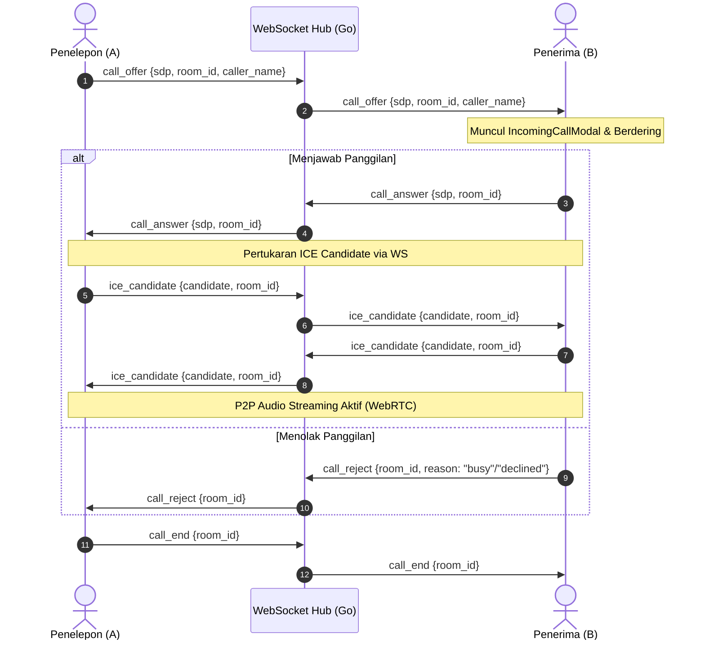

# 📞 Domain: WebRTC Real-Time Calling (`WEBRTC_CALLING`)

Dokumen ini adalah spesifikasi definitif untuk domain **Panggilan Suara Real-Time P2P (1-on-1 Voice Calling) via WebRTC** pada Wuzz Chat.

---

## 📋 1. Aturan Bisnis & Invarian (*Business Invariants*)

1. **P2P Audio Calling**:
   - Media audio ditransmisikan secara langsung *Peer-to-Peer* (P2P) antar-perangkat menggunakan WebRTC MediaStream tanpa melewati server utama (menjamin latensi ultra-rendah dan privasi).
2. **NAT & Firewall Traversal**:
   - Koneksi mengandalkan Google STUN server publik (`stun:stun.l.google.com:19302`) untuk pemetaan IP publik.
   - Dilengkapi fallback OpenRelay TURN server untuk menembus jaringan seluler bertipe *Symmetric NAT*.
3. **SDP Normalization & RFC Compliance**:
   - Klien seluler (Android/iOS) dan Web melakukan normalisasi atribut SDP DTLS fingerprint (`setup:actpass` pada penawar / `setup:active` pada penjawab) untuk mencegah kegagalan *handshake crypto negotiation* antar platform.
4. **Manajemen Rute Audio Seluler**:
   - Mendukung peralihan dinamis antara **Loudspeaker (Handsfree)** dan **Earpiece (Penerima Telinga)** menggunakan modul native audio.
5. **Nada Dering Prosedural**:
   - Nada panggil keluar (*ringback*) dan nada panggilan masuk (*ringtone*) dibangkitkan secara prosedural menggunakan Web Audio API / synthesizer audio lokal tanpa memerlukan aset berkas audio eksternal.
6. **Background & Cold-Start Call Push Notification (FCM v1)**:
   - Jika penerima tidak terhubung ke WebSocket (aplikasi di-background atau ditutup), backend otomatis memicu High-Priority Push Notification ke token FCM penerima (`type: "call_incoming"`).
   - Dilengkapi proteksi anti-spam (cooldown 5 detik per room), payload size guard (< 3500 bytes), serta sinyal pembatalan instan (`type: "call_cancelled"`).
7. **Multi-Device Signaling & Active Session Shielding (DEC-CALL-01 & DEC-CALL-02)**:
   - **Answer Delivery**: Event `call_answer` diteruskan ke seluruh perangkat sekunder Callee agar perangkat lain otomatis mematikan nada dering dan menutup modal panggilan masuk seketika saat panggilan dijawab di salah satu perangkat.
   - **Reject Shielding**: Ketika sesi panggilan di backend sudah berstatus `"answered"`, backend mengabaikan sinyal `call_reject` terlambat dan tidak menyebarkannya ke anggota room. Klien mobile dan web juga memproteksi status `connected` dari event `call_reject`.

---

## 📡 2. Protokol Signaling WebSocket

Signaling dijalankan melalui koneksi WebSocket yang sudah terotentikasi:

---

## 💻📱 3. Antarmuka Pengguna & Komponen (Web & Mobile)
- **Modal Panggilan Masuk**: `IncomingCallModal.tsx` dengan tema Aurora Dark Mode, avatar berkedip/pendar neon, serta tombol "Tolak" (merah) dan "Terima" (hijau).
- **Overlay Panggilan Aktif**: `ActiveCallOverlay.tsx` dengan live timer panggilan (mm:ss), toggle mute mikrofon, switch audio output, dan tombol tutup panggilan merah mengambang.

---

## 🌐 ICE/TURN & Status Media (5 Okt 2026)

1. **ICE servers dari backend**: `GET /api/calls/ice-servers` (JWT) mengembalikan STUN + TURN dengan kredensial sementara (TURN REST API: `username=<exp>:<userID>`, `credential=base64(HMAC-SHA1(TURN_SECRET, username))`, TTL `TURN_CREDENTIAL_TTL_SECONDS`, default 600). `TURN_SECRET` kosong = hanya STUN. Mobile (`fetchIceServers`, timeout 4 dtk) mengambilnya tiap panggilan dimulai/dijawab; gagal = STUN bawaan. TURN publik `openrelayproject` dihapus (tidak menghasilkan kandidat relay). Setup server: `docs/TURN_SETUP.md`.
2. **Status media jujur**: `CallSession.mediaState` (`connecting|connected|disconnected|failed`) berasal dari `RTCPeerConnection.connectionState`. Status sinyal `connected` (call_answer) hanya berarti dijawab; timer dan titik hijau baru muncul saat `mediaState==='connected'`. Bila media belum tersambung 25 dtk setelah dijawab → "Koneksi audio gagal". Belum ada ICE restart (butuh renegosiasi sinyal baru); dicatat sebagai pekerjaan lanjutan.
3. **Diagnosis**: panggilan "tersambung" tetapi sunyi = tidak ada media (diukur dari `/proc/net/dev`); WiFi dengan *client isolation* memaksa relay TURN.
4. **Skala & upgrade**: batas alokasi/bandwidth coturn, perkiraan kapasitas, pemantauan, uji beban, dan jalur upgrade (kuota -> TURN terpisah -> beberapa server -> TLS 443 -> TURN terkelola) ada di `docs/TURN_SETUP.md` bagian 6. Developer berikutnya: baca bagian itu **sebelum** jumlah pengguna naik.
5. **Pekerjaan lanjutan yang diketahui**: ICE restart (butuh renegosiasi sinyal), foreground service mikrofon untuk panggilan saat layar mati (butuh deklarasi Play Console), pemantauan otomatis coturn.

