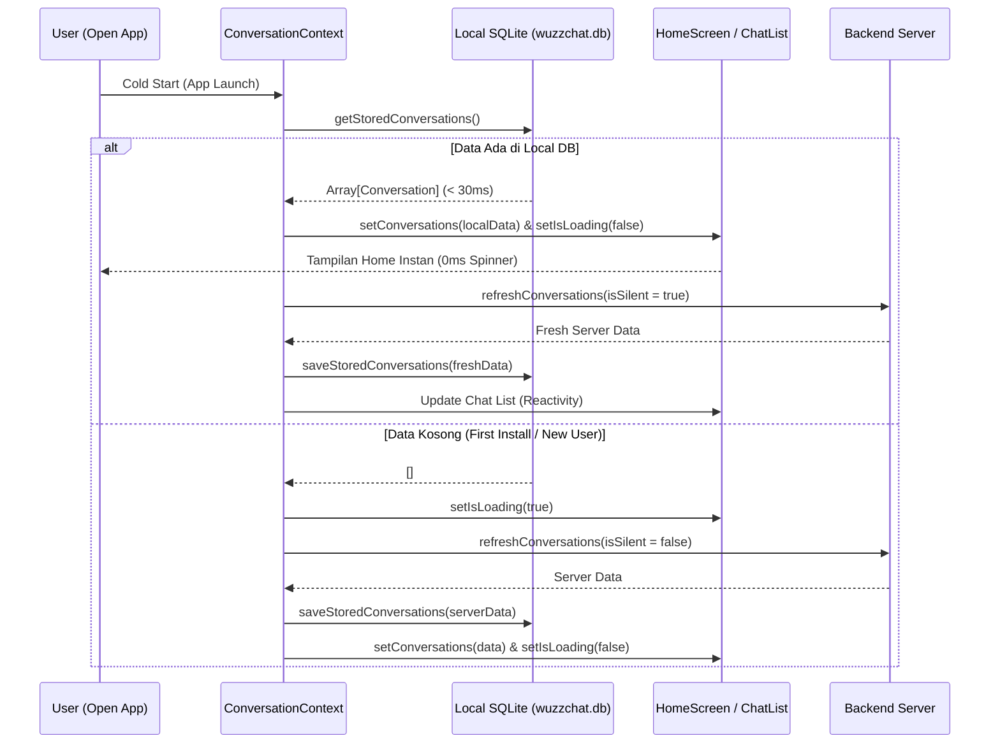

# IMPLEMENTATION PLAN — M-Mobile-8.18: Offline-First SQLite Storage

## 🎯 1. Ringkasan & Tujuan
Mengubah arsitektur WuzzChat Mobile dari *Network-First (In-Memory Only)* menjadi *Local-First (Offline-First Persistent Storage)* menggunakan SQLite lokal (`expo-sqlite`). Menghilangkan loading spinner pada Home Screen saat cold start dan menyajikan obrolan instan seperti WhatsApp.

---

## 🏗️ 2. Skema Database SQLite Lokal (`wuzzchat.db`)

### A. Tabel `local_conversations`
```sql
CREATE TABLE IF NOT EXISTS local_conversations (
    id TEXT PRIMARY KEY,
    type TEXT,
    name TEXT,
    avatar_url TEXT,
    last_message TEXT,
    last_message_at TEXT,
    unread_count INTEGER DEFAULT 0,
    is_pinned INTEGER DEFAULT 0,
    peer_id TEXT,
    peer_public_key TEXT,
    updated_at TEXT,
    raw_json TEXT
);
CREATE INDEX IF NOT EXISTS idx_conversations_updated ON local_conversations(is_pinned DESC, updated_at DESC);
```

### B. Tabel `local_messages`
```sql
CREATE TABLE IF NOT EXISTS local_messages (
    id TEXT PRIMARY KEY,
    room_id TEXT NOT NULL,
    sender_id TEXT NOT NULL,
    sender_nickname TEXT,
    content TEXT,
    type TEXT DEFAULT 'text',
    status TEXT DEFAULT 'sent',
    reply_to_id TEXT,
    media_url TEXT,
    local_media_uri TEXT,
    created_at TEXT NOT NULL,
    raw_json TEXT
);
CREATE INDEX IF NOT EXISTS idx_messages_room_created ON local_messages(room_id, created_at DESC);
```

---

## 🔄 3. Alur Eksekusi (Lifecycle & Hydration)



---

## 🧪 4. Strategi Pengujian & Verifikasi
1. **Linter & Typecheck Gate**: `cd mobile && npx tsc --noEmit` wajib 0 error.
2. **Cold Start Simulation**:
   - Memastikan pembacaan local database berhasil mengembalikan data sebelum network response tiba.
   - Memastikan `isLoading` langsung `false` jika data lokal tersedia.
3. **Build Native Release APK**: `cd mobile/android && ./gradlew assembleRelease` berhasil lolos tanpa error kompilasi native C++/Java/Android Gradle.
