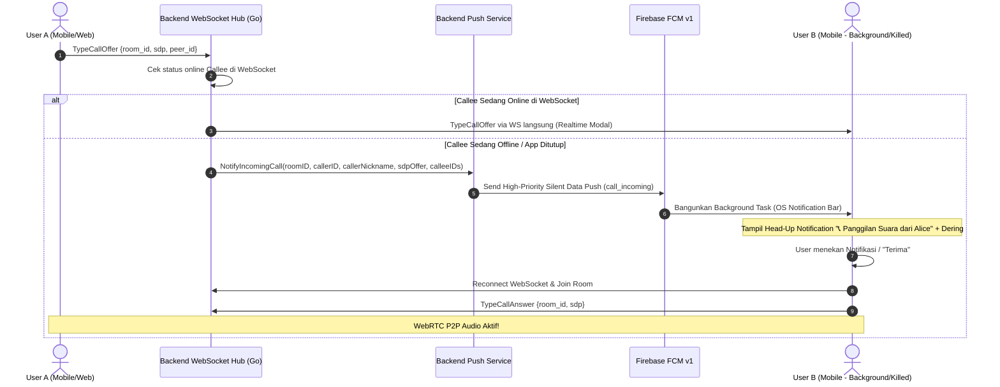

# Implementation Plan — WebRTC Call Background Push Notification

## 🎯 Objectives
Mengatasi masalah panggilan terputus/tidak masuk saat aplikasi mobile sedang tidak dibuka (background / killed) dengan memanfaatkan sinyal Firebase Cloud Messaging (FCM) High-Priority Data Push.

## 📂 Target Modified / Created Files
1. `backend/internal/push/push.go`: Menambahkan metode `NotifyIncomingCall` dan `NotifyCallCancelled`.
2. `backend/internal/push/push_test.go`: Menambahkan pengujian unit untuk kedua metode push panggilan baru.
3. `backend/internal/ws/client.go`: Memperluas penanganan `TypeCallOffer` dan `TypeCallEnd` di `onCallSignaling` agar memicu push ke penerima yang tidak aktif di room/WebSocket.
4. `mobile/src/services/notificationService.ts`: Menambahkan channel `wuzz_chat_calls` dengan `importance: MAX`, serta fungsi dismiss notifikasi.
5. `mobile/src/services/notificationBackgroundTask.ts`: Menambahkan logika rendering notifikasi panggilan masuk lokal dan pembersihan notifikasi saat panggilan dibatalkan.
6. `mobile/src/context/CallContext.tsx`: Menambahkan listener/handler untuk menerima panggilan yang dipicu dari notifikasi luar / background.
7. `mobile/App.tsx`: Mendaftarkan event handling tap notifikasi panggilan masuk untuk meluncurkan antarmuka panggilan.

## 🏗️ Technical Architecture & Flow

## 🧪 Verification Strategy
1. **Backend Verification**:
   - `go test -v ./internal/push/...`
   - `go test -v ./internal/ws/...`
   - `go test -v ./...` (memastikan 0 regresi di seluruh backend).
2. **Mobile Verification**:
   - `cd mobile && npx tsc --noEmit` (memastikan 0 error tipe TypeScript).
